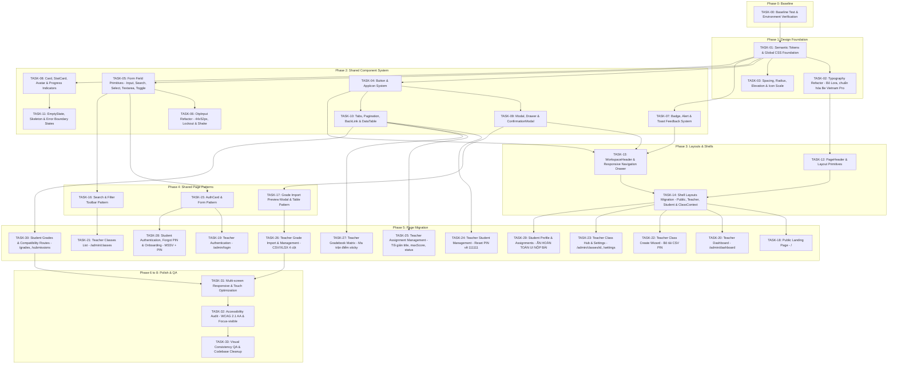

# MinBack — Kế hoạch thực thi tái thiết kế giao diện (UI Redesign Implementation Plan)

> **File:** `docs/UI_REDESIGN_PLAN.md`  
> **Source of Truth tối cao:** [`docs/MinBack_UI_Spec_Redesigned.md`](file:///d:/MinBack/docs/MinBack_UI_Spec_Redesigned.md) (Final Source of Truth cho UI Spec & Functional/Visibility Changes).  
> **Source hiện trạng codebase:** [`docs/ui-spec-current.md`](file:///d:/MinBack/docs/ui-spec-current.md) & Codebase Next.js 16.3.3 App Router (nhánh `dev` mới nhất).  
> **Nguyên tắc cốt lõi:**  
> 1. Không thay đổi business logic, API contract, auth flow, hay database schema trừ khi spec yêu cầu rõ.  
> 2. Các thay đổi về quyền truy cập/giao diện (như ẩn UI nộp bài của sinh viên theo F.2) là **Visibility Changes**, tuyệt đối **KHÔNG xóa backend/API/data/table/route**.  
> 3. Toàn bộ giao diện phải vận hành như **MỘT Design System duy nhất**: không màu hardcode, không shadow tuỳ tiện, không font serif Lora, không component trùng lặp.

---

## 1. SOURCE OF TRUTH & ARCHITECTURAL AUDIT

### A. Codebase Reality (Đặc thù kỹ thuật hiện trạng sau khi Pull Code)
- **Framework & Runtime:** Next.js 16.3.3 (App Router), React 19.2.8, TypeScript 6 (`^6.0.3`).
- **Styling Architecture:** **100% Vanilla CSS thuần** tập trung trong `src/app/globals.css` (3059 dòng). Codebase **hoàn toàn KHÔNG dùng Tailwind CSS**. Mọi token được cấu hình bằng CSS Custom Properties `:root`.
- **Iconography:** `lucide-react` v1.38.0 thông qua wrapper `src/components/ui/app-icon.tsx` (strokeWidth 1.8).
- **Typography hiện tại:** `next/font/google` nạp tại `src/app/layout.tsx`: `Be_Vietnam_Pro`, `Lora`, `IBM_Plex_Mono`.  
  *Yêu cầu spec mới:* **Loại bỏ hoàn toàn Lora (serif)**. Toàn bộ app dùng `Be Vietnam Pro` (400, 500, 700). `IBM Plex Mono` (400, 500) **chỉ dùng cho MSSV và Mã lớp**.
- **Client/Server Boundaries:** Data loader ban đầu ở Server Components (`src/server/services/*`). Client components (`"use client"`) quản lý state cục bộ, mutation API, debounce tìm kiếm và polling thông báo 30s.
- **Email-change contract:** `POST /api/v1/student/profile/email-change/request` nhận `{ email }`; `POST /api/v1/student/profile/email-change/confirm` nhận `{ otp }`. Email mới được giữ trong server challenge sau bước request, nên UI không gửi lại `newEmail` ở bước confirm.
- **Tiến độ backend vừa pull về:**
  - Route Quên PIN (`/class/[code]/forgot-pin`), schema & backend API (`request`, `confirm`) đã sẵn sàng.
  - Route import điểm (`/api/v1/teacher/assignments/[assignmentId]/evaluations/import`, `import-preview`, `import-template`) và modal sơ khai `GradeImportModal` đã có backend. Preview gửi `FormData` chứa file; sau preview import gửi JSON `{ mode, evaluations }`, không gửi lại file.
  - `class-create-flow.tsx` đã bỏ tải file CSV PIN và gate `beforeunload`, PIN mặc định là `111111`.
  - `student-assignment-modal.tsx` đã gỡ bỏ form upload submission.
  - *Tuy nhiên:* Hệ thống màu sắc (CTA vẫn vàng gold cũ), typography (vẫn Lora), elevation (vẫn dùng shadow), modal mobile (chưa chuyển bottom-sheet), và cấu trúc layout/view vẫn ở style cũ chưa đồng bộ Design System.

### B. Redesigned UI Specification Mandates (Yêu cầu bắt buộc từ Spec mới)
1. **Semantic Tokens (A.2):** Thay thế toàn bộ biến cũ (`--navy-900`, `--gold-500`...) bằng token ngữ nghĩa:
   - Brand & Action: `--color-primary` (`#1E3A4A`), `--color-primary-hover` (`#2C5468`), `--color-primary-active` (`#16303D`), `--color-primary-foreground` (`#FBFAF7`), `--color-accent` (`#F5B400`), `--color-accent-hover` (`#DFA300`), `--color-accent-foreground` (`#16303D`), `--color-secondary` (`#E7EEF1`), `--color-secondary-foreground` (`#2C5468`).
   - Surface & Text: `--color-background` (`#FBFAF7`), `--color-surface` (`#FFFFFF`), `--color-surface-elevated` (`#FFFFFF`), `--color-surface-subtle` (`#F3F6F7`), `--color-border` (`#E1E6E9`), `--color-border-strong` (`#C9D4D9`), `--color-text-primary` (`#16303D`), `--color-text-secondary` (`#4A6472`), `--color-text-muted` (`#7B898F`).
   - Feedback: `--color-success` (`#3D7A5F`), `--color-success-soft` (`#E5F1EB`), `--color-warning` (`#8A5A00`), `--color-warning-soft` (`#FFF3CC`), `--color-error` (`#B55249`), `--color-error-soft` (`#F8E8E6`), `--color-info` (`#2C5468`), `--color-info-soft` (`#E7EEF1`), `--color-neutral` (`#56666E`), `--color-neutral-soft` (`#F1F3F4`).
   - Overlays: `--color-overlay` (`rgba(22, 48, 61, 0.48)`), `--color-focus-ring` (`rgba(245, 180, 0, 0.45)`).
2. **Button Role Flip (B.1):** Nút CTA chính chuyển từ vàng sang **Navy đậm (`--color-primary`)**. Vàng kim (`--color-accent`) chỉ dành cho điểm nhấn thương hiệu, focus ring 3px và highlight.
3. **Card Styling (A.6, B.5):** Card tĩnh **elevation-0 (không shadow)**. Hover chỉ đổi viền sang `--color-accent`. Xóa sạch hard-shadow `13px 13px 0` và glassmorphism.
4. **Modal & Drawer on Mobile (B.7, B.8):** Trên thiết bị `≤ 800px`, Modal tự động chuyển thành **Bottom-sheet Drawer** trượt từ đáy với grab handle.
5. **Functional & Visibility Rules (F.1 - F.6):**
   - **Student Submission (F.2):** **Student UI KHÔNG được expose bất kỳ tính năng nộp bài nào** (không nút "Nộp bài ngay", không CTA nộp bài, không form upload trong modal, không navigation link). **UI-hidden ≠ Feature deleted:** Giữ nguyên 100% backend API, table `submissions` và compatibility route `/class/[code]/submissions`.
   - **Credential & PIN Defaults (F.5, C.5, C.7, C.12):** Sinh viên mới nhận PIN mặc định `111111`, nickname = MSSV, email suy ra từ MSSV. Bỏ hoàn toàn CSV PIN download và gate `beforeunload`. Reset PIN đưa về `111111`, response không chứa PIN thô.
   - **Đơn giản hóa Bài tập & Chấm điểm (C.8, C.9):** Assignment chỉ còn `title, maxScore, status` (bỏ description, deadline, attachment trên UI). Thay thế chấm bài thủ công bằng **Import CSV/XLSX 4 cột** (`MSSV | Họ tên | Điểm | Feedback`) có xem trước (preview) và 2 action: `Lưu bản chấm` (`graded` - chỉ GV thấy) và `Công bố kết quả` (`returned` - sinh viên xem được, phát sinh notification/email).

---

## 2. CODEBASE AUDIT & MIGRATION MATRIX

| Thành phần / File hiện tại | Trạng thái codebase | Quyết định xử lý theo Spec mới | Ghi chú kỹ thuật & Tác động |
|---|---|---|---|
| `src/app/globals.css` | 3059 dòng, biến màu mô tả, quy tắc layout cũ | **Refactor toàn diện** | Thay thế `:root` bằng Semantic Tokens, chuẩn hóa spacing scale (4..80), elevation scale, focus-visible |
| `src/app/layout.tsx` | Nạp font `Be_Vietnam_Pro`, `Lora`, `IBM_Plex_Mono` | **Refactor** | **Xóa bỏ Lora**. `Be_Vietnam_Pro` chỉ nạp 400, 500, 700. `IBM_Plex_Mono` chỉ nạp 400, 500 |
| `src/components/ui/button.tsx` | Nút CTA vàng, có hiệu ứng `translateY` | **Refactor** | Nút `primary` sang Navy `#1E3A4A`, thêm variant `destructive-outline`, bỏ translateY, min-height 42px/34px |
| `src/components/ui/input.tsx`, `search-input.tsx` | Form control cơ bản | **Refactor** | Bọc trong `.form-field` chuẩn, min-height 44px, viền border-strong hover, viền accent focus, hỗ trợ state success/error |
| `src/components/ui/otp-input.tsx` | Ô 40x48px, style inline | **Refactor** | Ô 44x52px, Be Vietnam Pro 1.25rem weight 700, thêm hiệu ứng rung (shake) khi lỗi, trạng thái lockout 429 |
| `src/components/ui/card.tsx` | Có prop `glass`, hover nâng shadow | **Refactor** | Bỏ `glass`, bỏ shadow (`--elevation-0`), thêm variant `interactive`, `highlighted` (viền trái accent 3px), `compact` |
| `src/components/ui/badge.tsx` | Class phân tán `.badge-*` | **Refactor** | Chuẩn hóa map cứng với bảng màu feedback (A.2.3): `graded` (success - GV), `returned` (primary - SV xem), `draft`, `warning` |
| `src/components/ui/modal.tsx` | Dialog căn giữa cố định | **Refactor** | Tự động chuyển thành **Bottom-sheet Drawer** trượt từ đáy màn hình khi viewport `≤ 800px` |
| `src/components/ui/drawer.tsx` | Chưa tồn tại độc lập | **Tạo mới** | Phục vụ menu mobile workspace trượt từ trên xuống và bottom-sheet modal |
| `src/components/ui/alert.tsx`, `toast.tsx` | Thông báo dùng banner tự chế, chưa có toast | **Tạo mới** | `Alert` cho thông báo inline (form error, lockout, test email); `Toast` cho mutation thành công (lưu điểm, đổi tên, reset PIN) |
| `src/components/ui/back-link.tsx` | Dùng `<Link className="btn btn-ghost">← ...</Link>` | **Tạo mới** | Component chuẩn hóa điều hướng lùi 1 cấp cha, tích hợp icon chevron trái |
| `src/components/ui/stat-card.tsx` | Dùng `DashboardMetric` với tone tự do | **Refactor / Chuẩn hóa** | Thay thế bằng `StatCard` chuẩn: icon trong ô soft, value Be Vietnam Pro 1.5rem 700, tone gắn liền ngữ nghĩa |
| `src/components/ui/empty-state.tsx` | Viết ad-hoc thẻ `<p className="muted">` | **Tạo mới** | Cấu trúc chuẩn: icon 20px trong ô 48px, tiêu đề H4, mô tả Body Small, CTA button |
| `src/components/ui/skeleton.tsx` | Chưa có skeleton, dùng chữ "Đang tải..." | **Tạo mới** | Pulse loading placeholder mô phỏng layout thực tế (tôn trọng reduced-motion) |
| `src/components/ui/confirmation-modal.tsx` | Dùng modal chung | **Tạo mới** | Chuyên biệt cho thao tác nguy hiểm (xóa lớp, xóa bài tập, công bố điểm, reset PIN về 111111) |
| `src/components/ui/data-table.tsx` | Table đơn giản trong `.table-wrap` | **Refactor** | Hỗ trợ cột đầu tiên sticky khi cuộn ngang trên mobile, header uppercase Be Vietnam Pro |
| `src/components/layout/workspace-header.tsx` | Header sticky, menu trượt mobile chưa chuẩn | **Refactor** | Dùng Drawer cho mobile menu, nav desktop có gạch chân active 2px accent, tích hợp chuông thông báo |
| `src/components/class-sections/teacher/class-create-flow.tsx` | Wizard 4 bước (đã bỏ tải PIN) | **Refactor UI** | Chuẩn hóa stepper theo thang đo mới, áp dụng Card default không shadow và Alert info chuẩn |
| `src/components/evaluations/teacher/bulk-grade-view.tsx` | Chấm tay inline + nút modal import | **Refactor toàn diện** | Chuyển view chính sang giao diện **Import file CSV/XLSX 4 cột & Preview**, bỏ bảng chấm tay và sticky save bar cũ |
| `src/components/evaluations/teacher/grade-import-modal.tsx` | Modal import mới pull về | **Tích hợp / Refactor** | Chuyển luồng preview và import 4 cột vào thẳng trang chính hoặc chuẩn hóa modal theo design tokens |
| `src/components/auth/student/pin-login-form.tsx` | Nhận input `nickname` + `pin` | **Refactor** | Đổi input sang **`MSSV` + PIN** (C.12); lần đầu dùng `111111`, thêm link Quên PIN |
| `src/components/auth/student/forgot-pin-form.tsx` | Form quên PIN mới pull về | **Refactor UI** | Bọc trong `AuthCard` chuẩn, dùng `OtpInput` nâng cấp và `Alert` thông báo chung an toàn |
| `src/components/students/student/student-workspace-view.tsx` | Vẫn còn deadline panel, link submissions | **Refactor (F.2)** | **Ẩn hoàn toàn** panel hạn nộp, tab submissions; chuyển trọng tâm sang xem kết quả trả về (`returned`) |
| `src/components/assignments/student/student-assignment-modal.tsx` | Đã gỡ upload panel | **Refactor UI** | Chuẩn hóa bố cục, typography và tokens theo spec C.15/C.16; chuyển thành bottom-sheet mobile |

---

## 3. DEPENDENCY GRAPH



---

## 4. CHI TIẾT CÁC IMPLEMENTATION TASKS

---

### PHASE 0 — AUDIT & BASELINE SETUP

#### TASK-00 — Thiết lập Baseline Test & Snapshot Kiểm thử UI
- **Phase:** Phase 0 — Audit & Baseline
- **Priority:** P0
- **Objective:** Xác lập trạng thái baseline của codebase, đảm bảo toàn bộ unit test, typecheck, lint hiện tại đều vượt qua trước khi thực hiện bất kỳ thay đổi thị giác nào.
- **Why:** Tránh tình trạng đổ lỗi hồi quy logic khi refactor CSS và JSX.
- **Depends On:** None.
- **Scope:**
  - Chạy `npm run typecheck` xác nhận 0 lỗi type.
  - Chạy kiểm tra test suites đơn lẻ xác nhận chức năng hoạt động.
  - Lập danh sách 19 route và trạng thái render hiện hành.
- **Out of Scope:** Không sửa code JSX/CSS hay thay đổi logic.
- **Specification References:** Section 1 (Source of Truth), D.4 (Final Quality Checklist).
- **Existing Code:** `package.json`, `vitest.config.ts`, `vitest.integration.config.ts`.
- **Implementation Steps:**
  1. Chạy `npm run typecheck`.
  2. Chạy `npx vitest run src/components/ui/ui-primitives.test.tsx`.
  3. Ghi nhận baseline hoàn tất.
- **Files To Modify:** Không có.
- **Files To Create:** Không có.
- **Files To Delete:** Không có.
- **Design System Requirements:** N/A.
- **Functional Constraints:** Giữ nguyên trạng thái pass của test suite.
- **Visibility / Access Rules:** N/A.
- **Responsive Requirements:** N/A.
- **Acceptance Criteria:**
  - [x] `npm run typecheck` hoàn thành 100% không có lỗi.
  - [x] `ui-primitives.test.tsx` pass 100%.
- **Verification:** Chạy `npm run typecheck`.
- **Risks / Notes:** Không reset database nếu không có chỉ định.
- **Definition of Done:** Baseline ổn định, sẵn sàng triển khai Phase 1.

---

### PHASE 1 — DESIGN FOUNDATION

#### TASK-01 — Semantic Design Tokens & Global CSS Foundation
- **Phase:** Phase 1 — Design Foundation
- **Priority:** P0
- **Objective:** Thay thế toàn bộ hệ thống biến mô tả cũ trong `src/app/globals.css` bằng hệ thống semantic tokens chuẩn theo mục A.2 của đặc tả.
- **Why:** Nền tảng cốt lõi của Design System; loại bỏ biến màu phân mảnh (`--navy-900`, `--gold-500`...) và hardcoded style.
- **Depends On:** `TASK-00`.
- **Scope:**
  - Định nghĩa biến CSS `:root` mới:
    - Brand & Action: `--color-primary` (`#1E3A4A`), `--color-primary-hover` (`#2C5468`), `--color-primary-active` (`#16303D`), `--color-primary-foreground` (`#FBFAF7`), `--color-accent` (`#F5B400`), `--color-accent-hover` (`#DFA300`), `--color-accent-foreground` (`#16303D`), `--color-secondary` (`#E7EEF1`), `--color-secondary-foreground` (`#2C5468`).
    - Surface & Text: `--color-background` (`#FBFAF7`), `--color-surface` (`#FFFFFF`), `--color-surface-elevated` (`#FFFFFF`), `--color-surface-subtle` (`#F3F6F7`), `--color-border` (`#E1E6E9`), `--color-border-strong` (`#C9D4D9`), `--color-text-primary` (`#16303D`), `--color-text-secondary` (`#4A6472`), `--color-text-muted` (`#7B898F`).
    - Feedback: `--color-success` (`#3D7A5F`), `--color-success-soft` (`#E5F1EB`), `--color-warning` (`#8A5A00`), `--color-warning-soft` (`#FFF3CC`), `--color-error` (`#B55249`), `--color-error-soft` (`#F8E8E6`), `--color-info` (`#2C5468`), `--color-info-soft` (`#E7EEF1`), `--color-neutral` (`#56666E`), `--color-neutral-soft` (`#F1F3F4`).
    - Overlays: `--color-overlay` (`rgba(22, 48, 61, 0.48)`), `--color-focus-ring` (`rgba(245, 180, 0, 0.45)`).
  - Khai báo focus-visible: `outline: 3px solid var(--color-focus-ring); outline-offset: 2px;`.
  - Thiết lập reset CSS, canvas background `--color-background`, text color `--color-text-primary`.
  - Giữ lại các alias tương thích ngược tạm thời để tránh vỡ giao diện trong các phase tiếp theo.
- **Out of Scope:** Không sửa đổi component JSX hay file logic.
- **Specification References:** A.1, A.2.1, A.2.2, A.2.3, A.2.4.
- **Existing Code:** `src/app/globals.css` (dòng 1–250).
- **Implementation Steps:**
  1. Đọc bảng màu A.2 trong `MinBack_UI_Spec_Redesigned.md`.
  2. Cập nhật khối `:root` trong `src/app/globals.css` với đầy đủ semantic tokens mới.
  3. Cấu hình quy tắc reset, focus-visible và container rules.
  4. Đặt alias chuyển tiếp từ các biến cũ sang token mới để tránh break app tức thì.
- **Files To Modify:** `src/app/globals.css`.
- **Files To Create:** Không có.
- **Files To Delete:** Không có.
- **Design System Requirements:** Đúng 100% mã HEX tại Mục A.2. Cấm hardcode màu ngoài bảng.
- **Functional Constraints:** Không làm ảnh hưởng logic render Next.js.
- **Visibility / Access Rules:** N/A.
- **Responsive Requirements:** N/A.
- **Acceptance Criteria:**
  - [x] `:root` chứa đầy đủ 100% semantic tokens theo bảng A.2.1, A.2.2, A.2.3, A.2.4.
  - [x] Focus-visible đạt chuẩn outline 3px accent offset 2px.
- **Verification:** Kiểm tra biên dịch CSS, mở trình duyệt kiểm tra `:root` qua DevTools.
- **Risks / Notes:** Giữ alias tạm thời để các component cũ chưa migrate vẫn hiển thị màu tương đối.
- **Definition of Done:** `globals.css` chứa toàn bộ foundation tokens mới không có lỗi cú pháp.

---

#### TASK-02 — Typography Refactor — Loại bỏ Lora, Chuẩn hóa Be Vietnam Pro
- **Phase:** Phase 1 — Design Foundation
- **Priority:** P0
- **Objective:** Loại bỏ hoàn toàn font serif `Lora` khỏi hệ thống theo quyết định spec mới; chuẩn hóa cấu hình font `Be Vietnam Pro` và `IBM Plex Mono`.
- **Why:** Tạo sự nhất quán học thuật hiện đại, loại bỏ font serif rườm rà; phân định rõ font Mono chỉ dành riêng cho MSSV và Mã lớp.
- **Depends On:** `TASK-01`.
- **Scope:**
  - Cập nhật `src/app/layout.tsx`:
    - **Xóa bỏ khai báo `Lora`**.
    - Cấu hình `Be_Vietnam_Pro` chỉ nạp weights `["400", "500", "700"]` (bỏ weight 600).
    - Cấu hình `IBM_Plex_Mono` chỉ nạp weights `["400", "500"]` (bỏ weight 600).
  - Cập nhật `src/app/globals.css`:
    - Định nghĩa typography scale theo bảng A.3: Display (`clamp(2.25rem, 4vw, 3.5rem)`), H1 (`1.75rem / 1.2`, 700), H2 (`1.375rem / 1.25`, 700), H3 (`1.125rem / 1.35`, 700), H4 (`0.9375rem / 1.4`, 700), Body Large (`1.0625rem`), Body (`0.9375rem`), Body Small (`0.8125rem`), Caption (`0.75rem`), Label (`0.73rem`, uppercase, letter-spacing +0.08em), Identity Data (Mono 500).
    - Gán font mặc định toàn app cho thẻ `body`, `h1`..`h4`, `button`, `input` là `var(--font-be-vietnam-pro)`.
- **Out of Scope:** Không thay đổi metadata title hay favicons.
- **Specification References:** A.3 Typography System.
- **Existing Code:** `src/app/layout.tsx`, `src/app/globals.css`.
- **Implementation Steps:**
  1. Gỡ bỏ `Lora` khỏi `src/app/layout.tsx` và xóa biến CSS `--font-lora` / `--font-display`.
  2. Điều chỉnh weights cho `Be_Vietnam_Pro` và `IBM_Plex_Mono`.
  3. Khai báo các utility class typography trong `src/app/globals.css`.
- **Files To Modify:** `src/app/layout.tsx`, `src/app/globals.css`.
- **Files To Create:** Không có.
- **Files To Delete:** Không có.
- **Design System Requirements:** 100% Be Vietnam Pro cho heading/body/control; IBM Plex Mono chỉ dùng cho MSSV và Mã lớp.
- **Functional Constraints:** Giữ nguyên `html lang="vi"`.
- **Visibility / Access Rules:** N/A.
- **Responsive Requirements:** H1/Display co dãn theo `clamp`.
- **Acceptance Criteria:**
  - [x] Font Lora không còn xuất hiện trong `layout.tsx` và `globals.css`.
  - [x] Cả H1, H2, H3, H4 đều hiển thị bằng Be Vietnam Pro weight 700.
  - [x] Cột MSSV và mã lớp nhận đúng class Mono.
- **Verification:** Kiểm tra dev server trong DevTools Computed Font Family.
- **Risks / Notes:** Đảm bảo các class cũ gọi font serif tự động fallback về Be Vietnam Pro.
- **Definition of Done:** Hệ thống font không còn serif, nạp đúng weights.

---

#### TASK-03 — Spacing, Radius, Elevation & Icon Scale
- **Phase:** Phase 1 — Design Foundation
- **Priority:** P0
- **Objective:** Chuẩn hóa thang đo Spacing, Radius, Elevation và quy tắc Icon trong `src/app/globals.css`.
- **Why:** Chấm dứt tình trạng dùng khoảng cách và bo góc tự do, đảm bảo card tĩnh không có bóng đổ.
- **Depends On:** `TASK-01`.
- **Scope:**
  - Spacing scale: `4 / 8 / 12 / 16 / 24 / 32 / 48 / 64 / 80` (A.4).
  - Radius scale: `--radius-sm: 6px`, `--radius-md: 8px`, `--radius-lg: 12px`, `--radius-xl: 16px`, `--radius-full: 999px` (A.5). Brand mark ngoại lệ `9px 9px 9px 2px`.
  - Elevation scale: `--elevation-0: none`, `--elevation-1: 0 1px 2px rgba(30,58,74,0.08)`, `--elevation-2: 0 10px 28px rgba(30,58,74,0.12)`, `--elevation-3: 0 20px 56px rgba(30,58,74,0.16)` (A.6).
  - Container width `1120px`, gutter desktop 24px, tablet 16px, mobile 12px (A.7).
  - Iconography: Stroke width cố định `1.8`, kích thước 16px / 18px / 20px (A.8).
- **Out of Scope:** Không sửa các trang UI.
- **Specification References:** A.4, A.5, A.6, A.7, A.8.
- **Existing Code:** `src/app/globals.css`.
- **Implementation Steps:**
  1. Thêm đầy đủ biến scale vào `:root` trong `globals.css`.
  2. Viết class tiện ích layout `.container-page`, `.grid-12`, v.v.
  3. Cập nhật quy tắc `.card` mặc định có `box-shadow: var(--elevation-0)`.
- **Files To Modify:** `src/app/globals.css`.
- **Files To Create:** Không có.
- **Files To Delete:** Không có.
- **Design System Requirements:** Thang spacing A.4, radius A.5, elevation A.6.
- **Functional Constraints:** Không làm ảnh hưởng responsive layout hiện tại.
- **Visibility / Access Rules:** N/A.
- **Responsive Requirements:** Áp dụng gutter và section spacing theo A.7.
- **Acceptance Criteria:**
  - [x] Toàn bộ các biến scale đã được khai báo.
  - [x] Card tĩnh không còn box-shadow.
- **Verification:** Kiểm tra CSS inspector.
- **Definition of Done:** Nền tảng đo lường và elevation hoàn thiện.

---

### PHASE 2 — SHARED COMPONENT SYSTEM

#### TASK-04 — Button & AppIcon System
- **Phase:** Phase 2 — Shared Components
- **Priority:** P0
- **Objective:** Tái cấu trúc component `Button` theo B.1 (chuyển CTA chính sang Navy `--color-primary`) và chuẩn hóa `AppIcon`.
- **Why:** Thành phần tương tác cốt lõi nhất của toàn ứng dụng; cần chuẩn hóa vai trò màu và trạng thái loading.
- **Depends On:** `TASK-01`, `TASK-03`.
- **Scope:**
  - `src/components/ui/button.tsx`:
    - Variants: `primary` (nền `--color-primary`, chữ primary-foreground), `secondary` (nền surface, viền border, chữ primary), `outline` (trong suốt, viền border-strong), `ghost` (trong suốt, hover secondary), `destructive` (nền error, chữ trắng), `destructive-outline` (viền error, chữ error).
    - Sizes: `md` (min-height 42px, padding 9px 16px, radius-md, font weight 700), `sm` (min-height 34px, padding 6px 12px). Full-width khi trong form mobile.
    - Loading: Hiển thị spinner nhỏ + nhãn ngữ cảnh ("Đang xử lý...", "Đang đăng nhập..."), disabled khi loading.
    - Loại bỏ hiệu ứng `translateY(-1px)`.
  - `src/components/ui/app-icon.tsx`: strokeWidth 1.8, bổ sung các icon cần thiết.
- **Out of Scope:** Không sửa các trang gọi Button ở bước này.
- **Specification References:** B.1 Button, A.8 Iconography.
- **Existing Code:** `src/components/ui/button.tsx`, `src/components/ui/app-icon.tsx`.
- **Implementation Steps:**
  1. Cập nhật props variant và size của `Button`.
  2. Viết CSS class trong `globals.css` dựa trên semantic tokens.
  3. Cập nhật `AppIcon` cố định `strokeWidth: 1.8`.
  4. Cập nhật unit test kiểm tra variant Button trong `src/components/ui/ui-primitives.test.tsx`.
- **Files To Modify:** `src/components/ui/button.tsx`, `src/components/ui/app-icon.tsx`, `src/app/globals.css`, `src/components/ui/ui-primitives.test.tsx`.
- **Files To Create:** Không có.
- **Files To Delete:** Không có.
- **Design System Requirements:** Nút primary nền Navy, chữ trắng sáng. Focus ring 3px accent.
- **Functional Constraints:** Kế thừa đầy đủ `ButtonHTMLAttributes<HTMLButtonElement>`.
- **Visibility / Access Rules:** N/A.
- **Responsive Requirements:** Đảm bảo touch target 44px trên mobile form.
- **Acceptance Criteria:**
  - [x] Nút primary có nền Navy `#1E3A4A`.
  - [x] Hỗ trợ đầy đủ 6 variants và 2 sizes.
  - [x] Bỏ hoàn toàn hiệu ứng nhảy vị trí khi hover.
- **Verification:** Chạy `npm test -- src/components/ui/ui-primitives.test.tsx`.
- **Definition of Done:** Button và AppIcon đạt 100% spec B.1 và A.8.

---

#### TASK-05 — Form Field Primitives (Input, SearchInput, Dropdown, Textarea, Toggle)
- **Phase:** Phase 2 — Shared Components
- **Priority:** P1
- **Objective:** Chuẩn hóa toàn bộ trường nhập liệu đạt touch target 44px, viền border-strong khi hover và viền accent khi focus (B.2, B.15).
- **Why:** Tạo sự đồng nhất cho mọi form (đăng nhập, tìm kiếm, nhập bài tập, đổi thông tin).
- **Depends On:** `TASK-01`, `TASK-03`.
- **Scope:**
  - `src/components/ui/input.tsx`: Cấu trúc `.form-field` gồm Label (Body Small 700), hint (Caption text-muted), control (min-height 44px, radius-md), error (Caption error, liên kết `aria-describedby`). Hỗ trợ variant `default`, `error`, `success`.
  - `src/components/ui/search-input.tsx`: Tích hợp icon Search 16px, nút clear text khi có giá trị.
  - `src/components/ui/dropdown.tsx`: Đồng bộ style viền, nền, padding và trạng thái focus.
  - `src/components/ui/textarea.tsx` [TẠO MỚI]: Form textarea min-height 80px, padding 12px 14px, radius-md.
  - `src/components/ui/toggle.tsx`: `role="switch"`, track 44x24px, màu xanh success khi on.
- **Out of Scope:** Không sửa logic validation schema Zod.
- **Specification References:** B.2, B.15.
- **Existing Code:** `src/components/ui/input.tsx`, `src/components/ui/search-input.tsx`, `src/components/ui/dropdown.tsx`, `src/components/ui/toggle.tsx`.
- **Implementation Steps:**
  1. Cập nhật `Input` và `SearchInput` với style và accessibility attributes.
  2. Tạo mới `src/components/ui/textarea.tsx`.
  3. Cập nhật `Dropdown` và `Toggle`.
  4. Bổ sung style các control trong `globals.css`.
- **Files To Modify:** `src/components/ui/input.tsx`, `src/components/ui/search-input.tsx`, `src/components/ui/dropdown.tsx`, `src/components/ui/toggle.tsx`, `src/app/globals.css`.
- **Files To Create:** `src/components/ui/textarea.tsx`.
- **Files To Delete:** Không có.
- **Design System Requirements:** Min-height 44px, viền border, focus ring 3px accent.
- **Functional Constraints:** Giữ nguyên các event handlers `onChange`, `onBlur`.
- **Visibility / Access Rules:** N/A.
- **Responsive Requirements:** Full-width trên màn hình nhỏ.
- **Acceptance Criteria:**
  - [x] Các input đạt chiều cao tối thiểu 44px.
  - [x] Trạng thái lỗi có viền đỏ và text lỗi liên kết aria.
- **Verification:** Unit test trong `ui-primitives.test.tsx`.
- **Definition of Done:** Bộ component nhập liệu đạt chuẩn B.2 và B.15.

---

#### TASK-06 — OtpInput Refactor — Touch Target, Lockout State & Shake Effect
- **Phase:** Phase 2 — Shared Components
- **Priority:** P1
- **Objective:** Nâng cấp `OtpInput` lên ô 44x52px, font Be Vietnam Pro 1.25rem 700, hỗ trợ rung nhẹ khi lỗi và khóa khi lockout 429 (B.3).
- **Why:** Phục vụ luồng Quên PIN, xác minh đổi email sinh viên và nhập PIN an toàn.
- **Depends On:** `TASK-01`, `TASK-05`.
- **Scope:**
  - Cập nhật `src/components/ui/otp-input.tsx`:
    - Ô kích thước 44x52px, radius-sm (6px), font Be Vietnam Pro 1.25rem 700.
    - Giữ nguyên cơ chế auto-advance, backspace lùi, paste 6 số, `-webkit-text-security: disc`.
    - Trạng thái error: đổi viền cụm sang `--color-error` + hiệu ứng rung 120ms (tắt khi `prefers-reduced-motion`).
    - Trạng thái locked: disabled toàn bộ + đếm ngược countdown.
- **Out of Scope:** Không sửa endpoint backend gửi OTP.
- **Specification References:** B.3 OtpInput.
- **Existing Code:** `src/components/ui/otp-input.tsx`.
- **Implementation Steps:**
  1. Cập nhật kích thước và font cho từng ô nhập trong `otp-input.tsx`.
  2. Thêm prop `isError`, `isLocked` và animation shake trong `globals.css`.
  3. Viết unit test cho hành vi paste và auto-advance.
- **Files To Modify:** `src/components/ui/otp-input.tsx`, `src/app/globals.css`.
- **Files To Create:** Không có.
- **Files To Delete:** Không có.
- **Design System Requirements:** Ô 44x52px, radius-sm, Be Vietnam Pro.
- **Functional Constraints:** Giữ nguyên callback `onComplete(pin)`.
- **Visibility / Access Rules:** N/A.
- **Responsive Requirements:** Co giãn đều trên mobile, không bị tràn màn hình 320px.
- **Acceptance Criteria:**
  - [x] Ô nhập đạt kích thước 44x52px.
  - [x] Nhập đủ 6 số kích hoạt `onComplete`.
- **Verification:** Unit test trong `ui-primitives.test.tsx`.
- **Definition of Done:** `OtpInput` đạt 100% spec B.3.

---

#### TASK-07 — Feedback System (Badge, Alert, Toast)
- **Phase:** Phase 2 — Shared Components
- **Priority:** P1
- **Objective:** Chuẩn hóa component `Badge` (B.4) và tạo mới 2 component thông báo `Alert` (inline) và `Toast` (global) theo B.9.
- **Why:** Đồng nhất cách thức biểu đạt trạng thái và phản hồi thao tác người dùng (thay thế các banner tự chế).
- **Depends On:** `TASK-01`, `TASK-04`.
- **Scope:**
  - `src/components/ui/badge.tsx`: Pill radius-full, padding 4px 10px, Caption weight 700. Variants map chặt chẽ: `info`, `success`, `warning`, `error`, `neutral`, `draft`, `returned` (nền primary, chữ primary-foreground).
    - Quy tắc ngữ nghĩa cố định: `graded` (Đã lưu bản chấm) -> `success` (chỉ GV thấy); `returned` (Đã công bố) -> `returned` (SV xem); `published` -> `info`; `closed` -> `neutral`.
  - `src/components/ui/alert.tsx` [TẠO MỚI]: Banner inline, radius-md, padding 12px 16px, icon + text. Variants: `success`, `info`, `warning`, `error`. Dùng cho lỗi form tổng, lockout, test email.
  - `src/components/ui/toast.tsx` [TẠO MỚI]: Thông báo nổi góc màn hình (dưới-phải desktop, đáy mobile), tự tắt sau 4s. Hook `useToast()`. Dùng cho xác nhận lưu bảng điểm, cập nhật sinh viên, reset PIN.
- **Out of Scope:** Không can thiệp API fetch.
- **Specification References:** B.4 Badge, B.9 Toast & Alert, A.2.3 Feedback tokens.
- **Existing Code:** `src/components/ui/badge.tsx`.
- **Implementation Steps:**
  1. Refactor `badge.tsx` với các variants chuẩn hóa.
  2. Tạo mới `src/components/ui/alert.tsx`.
  3. Tạo mới `src/components/ui/toast.tsx` và ToastProvider.
  4. Viết styles trong `globals.css`.
- **Files To Modify:** `src/components/ui/badge.tsx`, `src/app/globals.css`.
- **Files To Create:** `src/components/ui/alert.tsx`, `src/components/ui/toast.tsx`.
- **Files To Delete:** Không có.
- **Design System Requirements:** Cặp màu soft/solid chuẩn A.2.3, không tạo variant màu tự do.
- **Functional Constraints:** Toast có nút đóng, tự dismiss.
- **Visibility / Access Rules:** Quy tắc badge `graded` chỉ dùng cho GV; `returned` cho SV xem.
- **Responsive Requirements:** Toast dính đáy full-width trên mobile.
- **Acceptance Criteria:**
  - [x] Badge hiển thị đúng màu theo ngữ nghĩa trạng thái.
  - [x] Toast render ở góc màn hình và tự biến mất sau 4s thông qua `ToastProvider`/`useToast`.
- **Verification:** Unit test render component.
- **Definition of Done:** Hệ thống feedback sẵn sàng phục vụ các trang.

---

#### TASK-08 — Card, StatCard, Avatar & Progress Indicators
- **Phase:** Phase 2 — Shared Components
- **Priority:** P1
- **Objective:** Refactor `Card` (loại bỏ glassmorphism và shadow), chuẩn hóa `StatCard`, `Avatar` và các chỉ số tiến độ (B.5, B.12, B.13, B.14).
- **Why:** Cốt lõi của các khối hiển thị dữ liệu trên dashboard và danh sách.
- **Depends On:** `TASK-01`, `TASK-04`.
- **Scope:**
  - `src/components/ui/card.tsx`:
    - Variants: `default` (surface + border + padding 24px, radius-lg, **không shadow**), `interactive` (hover: viền accent, cursor pointer), `highlighted` (viền trái 3px accent), `compact` (padding 16px).
    - **Xóa bỏ prop `glass`**.
  - `src/components/ui/stat-card.tsx` [REFACTOR từ DashboardMetric]: Icon trong ô nền soft, value Be Vietnam Pro 1.5rem 700, label Body Small text-muted, tone chuẩn (`info`, `success`, `warning`, `primary`).
  - `src/components/ui/avatar.tsx`: Circle radius-full, initials 2 ký tự họ tên, nền secondary, chữ primary 700. Sizes: 32px, 40px, 48px.
  - `src/components/ui/progress-bar.tsx` & `mini-progress-ring.tsx`: Track surface-subtle, fill accent (hoặc success khi 100%), `role="progressbar"`.
- **Out of Scope:** Không sửa các trang gọi.
- **Specification References:** B.5, B.12, B.13, B.14.
- **Existing Code:** `src/components/ui/card.tsx`, `src/components/ui/dashboard-metric.tsx`.
- **Implementation Steps:**
  1. Cập nhật `card.tsx` xóa `glass`, thêm các variants mới.
  2. Chuẩn hóa `dashboard-metric.tsx` thành `stat-card.tsx`.
  3. Cập nhật `avatar.tsx`, `progress-bar.tsx`.
- **Files To Modify:** `src/components/ui/card.tsx`, `src/components/ui/dashboard-metric.tsx`, `src/app/globals.css`.
- **Files To Create:** `src/components/ui/stat-card.tsx` (hoặc refactor in-place).
- **Files To Delete:** Không có.
- **Design System Requirements:** Card tĩnh không shadow; hover chỉ đổi viền accent.
- **Functional Constraints:** Giữ nguyên logic tính phần trăm của progress.
- **Visibility / Access Rules:** N/A.
- **Responsive Requirements:** Card co dãn linh hoạt theo container.
- **Acceptance Criteria:**
  - [x] Card không còn hiệu ứng bóng đổ và glassmorphism.
  - [x] StatCard giữ đúng API hiện tại và dùng nền tảng token mới.
- **Verification:** Unit test trong `ui-primitives.test.tsx`.
- **Definition of Done:** Các thành phần hiển thị dữ liệu đạt 100% spec.

---

#### TASK-09 — Modal, Drawer & ConfirmationModal
- **Phase:** Phase 2 — Shared Components
- **Priority:** P1
- **Objective:** Tái cấu trúc `Modal` tự động chuyển thành Bottom-sheet Drawer trên mobile `≤ 800px`, tạo component `Drawer` độc lập và `ConfirmationModal` chuyên dụng (B.7, B.8, B.18).
- **Why:** Thống nhất trải nghiệm cửa sổ bật lên, tối ưu tuyệt đối cho thiết bị cảm ứng di động và đảm bảo an toàn cho thao tác nguy hiểm.
- **Depends On:** `TASK-01`, `TASK-04`.
- **Scope:**
  - `src/components/ui/modal.tsx`:
    - Desktop: Dialog căn giữa, sizes `sm` (440px), `md` (640px), `lg` (860px), padding 32px, radius-xl, elevation-3. Focus trap, Escape đóng.
    - **Mobile (`≤ 800px`): Tự động chuyển thành Bottom-sheet Drawer** — trượt từ đáy, bo tròn 2 góc trên (radius-xl), có grab handle ở đỉnh, cuộn nội dung bên trong.
  - `src/components/ui/drawer.tsx` [TẠO MỚI]: Hỗ trợ 2 dạng: Mobile Nav panel (trượt từ trên xuống dưới header) và Bottom-sheet panel.
  - `src/components/ui/confirmation-modal.tsx` [TẠO MỚI]: Hộp thoại xác nhận thao tác nguy hiểm (xóa lớp, xóa bài tập, công bố điểm, reset PIN về 111111) với nút destructive rõ ràng.
- **Out of Scope:** Không sửa các modal nghiệp vụ cụ thể.
- **Specification References:** B.7 Modal, B.8 Drawer, B.18 Confirmation states.
- **Existing Code:** `src/components/ui/modal.tsx`.
- **Implementation Steps:**
  1. Cập nhật `modal.tsx` với media query chuyển layout bottom-sheet khi `≤ 800px`.
  2. Tạo mới `src/components/ui/drawer.tsx`.
  3. Tạo mới `src/components/ui/confirmation-modal.tsx`.
  4. Viết animation trượt bottom-sheet và grab handle trong `globals.css`.
- **Files To Modify:** `src/components/ui/modal.tsx`, `src/app/globals.css`.
- **Files To Create:** `src/components/ui/drawer.tsx`, `src/components/ui/confirmation-modal.tsx`.
- **Files To Delete:** Không có.
- **Design System Requirements:** Backdrop `--color-overlay` blur 4px; elevation-3; grab handle 36x4px radius-full.
- **Functional Constraints:** Giữ focus trap tuần hoàn, Escape đóng và khóa scroll body khi mở.
- **Visibility / Access Rules:** N/A.
- **Responsive Requirements:** Tự động chuyển bottom-sheet trên màn hình `≤ 800px`.
- **Acceptance Criteria:**
  - [x] Khi viewport `≤ 800px`, Modal mở từ đáy màn hình với grab handle.
  - [x] Phím Escape đóng modal ngay lập tức.
- **Verification:** Resize trình duyệt qua mốc 800px và kiểm tra chuyển đổi modal.
- **Definition of Done:** Modal và Drawer sẵn sàng, đáp ứng quy tắc responsive toàn cục.

---

#### TASK-10 — Tabs, Pagination, BackLink & DataTable
- **Phase:** Phase 2 — Shared Components
- **Priority:** P1
- **Objective:** Chuẩn hóa `Tabs`, `Pagination`, tạo component `BackLink` và nâng cấp `DataTable` hỗ trợ cột sticky trên mobile (B.6, B.10, B.11, B.17).
- **Why:** Thống nhất điều hướng trong bảng dữ liệu, chuyển trang và quay lại cấp cha.
- **Depends On:** `TASK-01`, `TASK-04`.
- **Scope:**
  - `src/components/ui/tabs.tsx`: `role="tablist"`, gạch chân active 2px `--color-accent`, nhãn Body 700 khi active kèm số đếm trong ngoặc. Mobile cuộn ngang mượt mà.
  - `src/components/ui/pagination.tsx`: Text chuẩn "Hiển thị X–Y trên tổng số Z [thực thể]"; nút active nền `--color-primary` + chữ trắng; nút icon ghost sm.
  - `src/components/ui/back-link.tsx` [TẠO MỚI]: Nút điều hướng lùi 1 cấp cha với icon chevron trái và nhãn rõ ràng.
  - `src/components/ui/data-table.tsx`: Header nền surface-subtle, text uppercase Label; phân cách border-bottom 1px (không zebra striping); hàng hover nền secondary; **mobile hỗ trợ cuộn ngang và cột đầu tiên sticky** (cho danh sách sinh viên, bảng điểm ma trận).
- **Out of Scope:** Không sửa các trang gọi.
- **Specification References:** B.6, B.10, B.11, B.17.
- **Existing Code:** `src/components/ui/pagination.tsx`, `src/components/ui/data-table.tsx`.
- **Implementation Steps:**
  1. Tạo mới `src/components/ui/back-link.tsx`.
  2. Tạo/cập nhật `tabs.tsx` với chỉ báo gạch chân accent.
  3. Cập nhật `pagination.tsx` đổi nút active sang Navy.
  4. Cập nhật `data-table.tsx` với class `.table-sticky-col`.
- **Files To Modify:** `src/components/ui/pagination.tsx`, `src/components/ui/data-table.tsx`, `src/app/globals.css`.
- **Files To Create:** `src/components/ui/back-link.tsx`, `src/components/ui/tabs.tsx`.
- **Files To Delete:** Không có.
- **Design System Requirements:** Nút trang active Navy chữ trắng; gạch chân tab màu vàng accent.
- **Functional Constraints:** Giữ nguyên các prop callback phân trang và chuyển tab.
- **Visibility / Access Rules:** N/A.
- **Responsive Requirements:** Bảng dữ liệu có cột sticky khi cuộn ngang trên điện thoại.
- **Acceptance Criteria:**
  - [x] DataTable cuộn ngang không bị che mất cột MSSV/Họ tên trên mobile.
  - [x] Nút active phân trang mang màu Navy chuẩn.
- **Verification:** Unit test render component.
- **Definition of Done:** Các component bảng và phân trang đạt chuẩn B.6, B.10, B.11.

---

#### TASK-11 — EmptyState, Skeleton & Error Boundary States
- **Phase:** Phase 2 — Shared Components
- **Priority:** P1
- **Objective:** Xây dựng hệ thống trạng thái rỗng `EmptyState`, khung chờ `Skeleton` và trạng thái lỗi inline/boundary theo B.18.
- **Why:** Xóa bỏ tình trạng hiển thị text thô "Không có dữ liệu" hoặc spinner quay toàn trang gây giật layout.
- **Depends On:** `TASK-01`, `TASK-04`.
- **Scope:**
  - `src/components/ui/empty-state.tsx` [TẠO MỚI]: Icon 20px trong ô surface-subtle 48px, tiêu đề H4, mô tả Body Small text-muted, nút CTA optional.
  - `src/components/ui/skeleton.tsx` [TẠO MỚI]: Khối placeholder nền surface-subtle pulse 1.2s (tôn trọng `prefers-reduced-motion`).
  - Cập nhật quy tắc hiển thị lỗi inline kết hợp component `Alert error` và nút thử lại.
- **Out of Scope:** Không sửa các trang nghiệp vụ.
- **Specification References:** B.18 Empty / Loading / Error states.
- **Existing Code:** Không có component tập trung.
- **Implementation Steps:**
  1. Tạo `src/components/ui/empty-state.tsx`.
  2. Tạo `src/components/ui/skeleton.tsx`.
  3. Thêm animation pulse trong `globals.css`.
- **Files To Modify:** `src/app/globals.css`.
- **Files To Create:** `src/components/ui/empty-state.tsx`, `src/components/ui/skeleton.tsx`.
- **Files To Delete:** Không có.
- **Design System Requirements:** EmptyState có khung icon 48px bo tròn; Skeleton màu surface-subtle.
- **Functional Constraints:** Không làm chậm thời gian render ban đầu.
- **Visibility / Access Rules:** N/A.
- **Responsive Requirements:** Co giãn theo chiều rộng container.
- **Acceptance Criteria:**
  - [x] `EmptyState` render đẹp mắt có tiêu đề và mô tả.
  - [x] `Skeleton` hiển thị pulse animation mượt mà.
- **Verification:** Unit test render.
- **Definition of Done:** Bộ 3 trạng thái rỗng/chờ/lỗi sẵn sàng tái sử dụng trên mọi trang.

---

### PHASE 3 — LAYOUTS & SHELLS

#### TASK-12 — PageHeader & Layout Primitives
- **Phase:** Phase 3 — Layouts & Shells
- **Priority:** P1
- **Objective:** Xây dựng component `PageHeader` chuẩn hóa (A.7) gồm Eyebrow Label, H1 duy nhất, đoạn mô tả và cụm nút hành động.
- **Why:** Loại bỏ sự lặp lại code tiêu đề trang rải rác trên 19 route, đảm bảo đúng chuẩn semantic SEO (1 H1 duy nhất).
- **Depends On:** `TASK-02`, `TASK-03`, `TASK-10`.
- **Scope:**
  - `src/components/layout/page-header.tsx` [TẠO MỚI]:
    - `BackLink` optional ở trên cùng.
    - Eyebrow: Label Be Vietnam Pro uppercase letter-spacing +0.08em.
    - Title: H1 Be Vietnam Pro 1.75rem 700.
    - Description: Body text-secondary.
    - Actions: Cụm nút căn phải desktop, xếp dưới title full-width trên mobile.
- **Out of Scope:** Không sửa layout tổng thể.
- **Specification References:** A.3, A.7 Grid & Layout, B.17.
- **Existing Code:** Các đoạn header viết tay trong từng page.
- **Implementation Steps:**
  1. Tạo `src/components/layout/page-header.tsx`.
  2. Viết CSS responsive cho page-header trong `globals.css`.
- **Files To Modify:** `src/app/globals.css`.
- **Files To Create:** `src/components/layout/page-header.tsx`.
- **Files To Delete:** Không có.
- **Design System Requirements:** Đúng cấu trúc Eyebrow -> H1 -> Description -> Actions.
- **Functional Constraints:** Nhận props tiêu đề, mô tả và action slot linh hoạt.
- **Visibility / Access Rules:** N/A.
- **Responsive Requirements:** Xếp dọc trên màn hình `≤ 800px`.
- **Acceptance Criteria:**
  - [x] Trang chỉ có đúng 1 thẻ H1.
  - [x] Nút action tự động dàn hàng ngang desktop, xếp dọc mobile.
- **Verification:** Render thử component trong môi trường test.
- **Definition of Done:** `PageHeader` hoàn thành sẵn sàng cho Phase 5.

---

#### TASK-13 — WorkspaceHeader & Responsive Navigation Drawer
- **Phase:** Phase 3 — Layouts & Shells
- **Priority:** P1
- **Objective:** Tái cấu trúc `WorkspaceHeader` và menu điều hướng di động sử dụng `Drawer` (B.8, B.16, D.2).
- **Why:** Đảm bảo header workspace dính cố định, nhận diện thương hiệu nhất quán và menu mobile trượt mượt mà.
- **Depends On:** `TASK-04`, `TASK-07`, `TASK-09`.
- **Scope:**
  - `src/components/layout/workspace-header.tsx`:
    - Chiều cao: 70px desktop, 62px mobile (`≤ 800px`).
    - Nền `--color-primary` (`#1E3A4A`), chữ trắng sáng.
    - Nav desktop: Link active có gạch chân 2px `--color-accent` và font weight 700.
    - Mobile: Nút hamburger mở `Drawer` trượt từ trên xuống dưới header, chứa danh sách điều hướng và nút Đăng xuất. Phím Escape đóng drawer.
    - `NotificationBell` & Popover (B.16): Icon ghost, chấm đỏ unread (hoặc số "9+"), popover rộng 360px có link "Xem tất cả".
- **Out of Scope:** Không sửa logic polling thông báo 30s hay auth cookie.
- **Specification References:** B.8 Drawer, B.16 NotificationBell, D.2 Responsive Rules.
- **Existing Code:** `src/components/layout/workspace-header.tsx`, `src/components/ui/notification-bell.tsx`.
- **Implementation Steps:**
  1. Thay thế menu mobile cũ bằng `Drawer` trong `workspace-header.tsx`.
  2. Cập nhật CSS cho `.workspace-header` và active underline trong `globals.css`.
  3. Chuẩn hóa popover của `NotificationBell`.
- **Files To Modify:** `src/components/layout/workspace-header.tsx`, `src/components/ui/notification-bell.tsx`, `src/app/globals.css`.
- **Files To Create:** Không có.
- **Files To Delete:** Không có.
- **Design System Requirements:** Header Navy đồng nhất; active indicator màu vàng accent.
- **Functional Constraints:** Giữ nguyên các route điều hướng của Teacher và Student.
- **Visibility / Access Rules:** N/A.
- **Responsive Requirements:** Breakpoint 800px chuyển đổi giữa nav ngang và hamburger drawer.
- **Acceptance Criteria:**
  - [x] Header sticky với elevation-1.
  - [x] Menu mobile mở trượt mượt mà, bấm Escape tự đóng.
  - [x] Link active hiển thị gạch chân vàng rõ ràng.
- **Verification:** Kiểm tra co dãn viewport qua mốc 800px.
- **Definition of Done:** Header chuẩn hóa cho cả 2 workspace Giảng viên và Sinh viên.

---

#### TASK-14 — Shell Layouts Migration (Public, Teacher, ClassContext & Student)
- **Phase:** Phase 3 — Layouts & Shells
- **Priority:** P1
- **Objective:** Áp dụng hệ thống khung bao layout mới cho Public shell, Teacher shell, Student shell và Class Context navigation (A.7, C.6).
- **Why:** Đảm bảo mọi trang khi render đều nằm trong container `1120px` với padding và gutter chuẩn theo thang A.4 và A.7.
- **Depends On:** `TASK-12`, `TASK-13`.
- **Scope:**
  - `src/app/admin/(protected)/layout.tsx`: Bọc nội dung trong container `1120px`, padding `48px 0 64px` (desktop) / `32px 0 48px` (mobile).
  - `src/app/admin/(protected)/classes/[id]/layout.tsx` & `src/components/class-sections/teacher/class-context-nav.tsx`: ClassContextNav dùng `BackLink` "← Danh sách lớp học" + Badge mã lớp accent (font mono) + H1 tên lớp.
  - `src/components/layout/student/student-workspace.tsx`: Container chuẩn và context layout.
  - Chuẩn hóa class `.public-shell`: Nền background + radial gradient accent mờ nhẹ (≤ 6% opacity) ở góc.
- **Out of Scope:** Không can thiệp mã kiểm tra session server.
- **Specification References:** A.7 Grid & Layout, C.6 ClassContextNav.
- **Existing Code:** Các file layout tại `src/app/admin/(protected)/layout.tsx`, `src/app/admin/(protected)/classes/[id]/layout.tsx`, `src/components/layout/student/student-workspace.tsx`.
- **Implementation Steps:**
  1. Cập nhật các file layout sử dụng container chuẩn.
  2. Nâng cấp `ClassContextNav` với `BackLink` và Badge mã lớp.
  3. Cập nhật CSS cho `.public-shell` trong `globals.css`.
- **Files To Modify:**
  - `src/app/admin/(protected)/layout.tsx`
  - `src/app/admin/(protected)/classes/[id]/layout.tsx`
  - `src/components/class-sections/teacher/class-context-nav.tsx`
  - `src/components/layout/student/student-workspace.tsx`
  - `src/app/globals.css`
- **Files To Create:** Không có.
- **Files To Delete:** Không có.
- **Design System Requirements:** Gutter 24px/16px/12px; section spacing 48px/32px.
- **Functional Constraints:** Giữ nguyên các redirect bảo mật khi chưa xác thực.
- **Visibility / Access Rules:** N/A.
- **Responsive Requirements:** Không bị tràn ngang trên màn hình 320px.
- **Acceptance Criteria:**
  - [x] Khung layout đồng nhất, căn giữa 1120px.
  - [x] ClassContextNav hiển thị rõ ràng đường dẫn quay lại và mã lớp.
- **Verification:** Điều hướng qua các layout để xác nhận cấu trúc khung bao.
- **Definition of Done:** Bộ khung shell hoàn chỉnh, sẵn sàng cho việc migrate từng trang.

---

### PHASE 4 — SHARED PAGE PATTERNS

#### TASK-15 — AuthCard & Form Pattern
- **Phase:** Phase 4 — Shared Patterns
- **Priority:** P1
- **Objective:** Xây dựng pattern `AuthCard` dùng chung cho các màn hình đăng nhập, quên PIN, hoàn tất tài khoản (C.2, C.12, C.13A, C.14).
- **Why:** Tránh viết lại cấu trúc card căn giữa và xử lý lỗi form trên 4 route xác thực độc lập.
- **Depends On:** `TASK-05`, `TASK-07`, `TASK-08`.
- **Scope:**
  - Tạo pattern cấu trúc: Thẻ Card radius-xl (16px), padding 32px (desktop) / 24px (mobile), max-width 440px căn giữa trong `public-shell`.
  - Cấu trúc: Brand mark / Eyebrow -> H1 tiêu đề -> mô tả Body Small -> `Alert error` tổng (khi có lỗi server) -> Form fields -> Nút submit primary full-width -> Footer link dùng `BackLink`.
- **Out of Scope:** Không can thiệp API auth.
- **Specification References:** C.2, C.12, C.13A, C.14, D.1 Form patterns.
- **Existing Code:** Các form đăng nhập tại `src/components/auth/`.
- **Implementation Steps:**
  1. Tạo component wrapper hoặc utility class `.auth-card` trong `globals.css`.
  2. Chuẩn hóa vị trí hiển thị `Alert error` phía trên form.
- **Files To Modify:** `src/app/globals.css`.
- **Files To Create:** `src/components/auth/auth-card.tsx` (tùy chọn component bọc).
- **Files To Delete:** Không có.
- **Design System Requirements:** Card radius-xl, padding 32px/24px, không shadow.
- **Functional Constraints:** Giữ nguyên các form submit handler.
- **Visibility / Access Rules:** N/A.
- **Responsive Requirements:** Dạt viền 12px trên mobile.
- **Acceptance Criteria:**
  - [x] Các trang đăng nhập sử dụng chung pattern và class.
- **Verification:** So sánh trực quan giữa màn hình login teacher và student.
- **Definition of Done:** Pattern AuthCard hoàn thành.

---

#### TASK-16 — Search & Filter Toolbar Pattern
- **Phase:** Phase 4 — Shared Patterns
- **Priority:** P1
- **Objective:** Xây dựng pattern thanh công cụ tìm kiếm và lọc dữ liệu (SearchInput bên trái, Tabs lọc hoặc Nút hành động bên phải) (C.4, C.7, C.8).
- **Why:** Đảm bảo thanh thao tác trên các trang danh sách lớp, sinh viên, bài tập có hành vi co giãn responsive đồng nhất.
- **Depends On:** `TASK-05`, `TASK-10`.
- **Scope:**
  - Layout toolbar: Dàn ngang trên desktop (space-between), SearchInput tối đa 400px; tự động xếp dọc full-width trên mobile (`≤ 800px`).
- **Out of Scope:** Không sửa logic fetch danh sách.
- **Specification References:** C.4, C.7, C.8, D.2.
- **Existing Code:** Các thanh toolbar viết tay trong từng view.
- **Implementation Steps:**
  1. Tạo class `.toolbar-action-group` trong `globals.css`.
  2. Quy định khoảng cách gap 16px và responsive xếp chồng.
- **Files To Modify:** `src/app/globals.css`.
- **Files To Create:** Không có.
- **Files To Delete:** Không có.
- **Design System Requirements:** Gap 16px, SearchInput max 400px.
- **Functional Constraints:** Giữ debounce tìm kiếm 300ms.
- **Visibility / Access Rules:** N/A.
- **Responsive Requirements:** Xếp dọc 100% width khi `≤ 800px`.
- **Acceptance Criteria:**
  - [x] Toolbar tự động xếp dọc trên mobile mượt mà.
- **Verification:** Kiểm tra resize responsive.
- **Definition of Done:** Pattern Toolbar hoàn thành.

---

#### TASK-17 — Grade Import Preview Modal & Table Pattern
- **Phase:** Phase 4 — Shared Patterns
- **Priority:** P1
- **Objective:** Xây dựng pattern bảng xem trước kết quả import tệp CSV/XLSX 4 cột cho chức năng chấm bài tập mới (C.9).
- **Why:** Phục vụ luồng nghiệp vụ cốt lõi mới của giảng viên (thay thế chấm tay bằng import file).
- **Depends On:** `TASK-07`, `TASK-09`, `TASK-10`.
- **Scope:**
  - Khung xem trước import:
    - 4 StatCard/Badge count tổng hợp: Create / Update / Unchanged / Invalid.
    - `ImportPreviewTable`: 5 cột rõ ràng gồm `MSSV (mono) | Họ tên | Điểm | Feedback | Kết quả`.
    - Dòng có họ tên lệch hiển thị cảnh báo warning; dòng invalid hiển thị lý do lỗi cụ thể màu error.
    - Action "Tải dòng lỗi" (CSV) khi có dữ liệu không hợp lệ.
- **Out of Scope:** Không sửa backend parser.
- **Specification References:** C.9, F.5.
- **Existing Code:** `src/components/evaluations/teacher/grade-import-modal.tsx`.
- **Implementation Steps:**
  1. Tạo component `src/components/evaluations/teacher/import-preview-table.tsx` (tách từ `grade-import-modal.tsx` để tái sử dụng).
  2. Định dạng cột MSSV font Identity Data Mono.
  3. Viết style cho các trạng thái dòng import trong `globals.css`.
- **Files To Modify:** `src/app/globals.css`, `src/components/evaluations/teacher/grade-import-modal.tsx`.
- **Files To Create:** `src/components/evaluations/teacher/import-preview-table.tsx`.
- **Files To Delete:** Không có.
- **Design System Requirements:** Cột MSSV dùng IBM Plex Mono; trạng thái dòng dùng cặp màu feedback A.2.3.
- **Functional Constraints:** Giữ nguyên dữ liệu preview từ API trả về.
- **Visibility / Access Rules:** Chỉ giảng viên sử dụng.
- **Responsive Requirements:** Cuộn ngang mượt mà trên mobile, giữ cột MSSV sticky nếu cần.
- **Acceptance Criteria:**
  - [x] Bảng preview hiển thị rõ ràng 5 cột và phân biệt được dòng lỗi/dòng hợp lệ.
- **Verification:** Render bảng với dữ liệu mock 10 dòng import.
- **Definition of Done:** Pattern bảng xem trước import hoàn thành.

---

### PHASE 5 — PAGE MIGRATION (19 ROUTES)

#### TASK-18 — Migrate Trang chủ (Landing Page) — `/`
- **Phase:** Phase 5 — Page Migration
- **Priority:** P2
- **Objective:** Thiết kế lại trang chủ `/` theo đúng đặc tả C.1: loại bỏ hard-shadow vàng, áp dụng Display font Be Vietnam Pro, chuẩn hóa thẻ nguyên tắc và form tra cứu lớp học.
- **Why:** Bộ mặt công khai của hệ thống; loại bỏ các hiệu ứng đồ họa cũ không thuộc Design System.
- **Depends On:** `TASK-04`, `TASK-05`, `TASK-07`, `TASK-08`, `TASK-14`.
- **Scope:**
  - `src/app/page.tsx`:
    - Hero: Tiêu đề Display Be Vietnam Pro 700 + Body Large lead; pill tag chuyển thành `Badge info`.
    - Bỏ hard-shadow vàng `13px 13px 0`: `landing-preview` trở thành `Card default` với viền trái 3px accent; bảng mô phỏng dùng DataRow.
    - 3 thẻ nguyên tắc chuyển thành `Card compact` với icon tone info (grid 3 cột desktop -> 1 cột mobile `≤ 800px`).
    - Ghi chú bảo mật: Caption + icon LockKeyhole 16px text-muted.
  - `src/components/auth/student/class-lookup-form.tsx`:
    - Input mã lớp và Button primary tạo thành cụm input group liền mạch, nút "Vào lớp →" rộng tối thiểu 120px.
- **Out of Scope:** Không thêm gọi API (trang chủ thuần client routing).
- **Specification References:** C.1 Landing.
- **Existing Code:** `src/app/page.tsx`, `src/components/auth/student/class-lookup-form.tsx`.
- **Implementation Steps:**
  1. Cập nhật `src/app/page.tsx` sử dụng Card, Badge, typography mới.
  2. Refactor `ClassLookupForm` sử dụng Button primary nền Navy.
  3. Xóa các class CSS hard-shadow cũ trong `globals.css`.
- **Files To Modify:** `src/app/page.tsx`, `src/components/auth/student/class-lookup-form.tsx`, `src/app/globals.css`.
- **Files To Create:** Không có.
- **Files To Delete:** Không có.
- **Design System Requirements:** Không shadow trang trí; CTA nền Navy; Display Be Vietnam Pro.
- **Functional Constraints:** Nhập mã lớp -> chuyển hướng sang `/class/[CODE]` chính xác.
- **Visibility / Access Rules:** Công khai (Public).
- **Responsive Requirements:** 1 cột trên mobile `≤ 800px`.
- **Acceptance Criteria:**
  - [x] Bỏ hoàn toàn hard-shadow vàng; thẻ xem trước có vạch accent bên trái.
  - [x] Form tra cứu tự động viết hoa mã lớp và điều hướng đúng.
- **Verification:** Mở trang chủ trên desktop và mobile 375px.
- **Definition of Done:** Trang chủ hoàn tất migration theo spec C.1.

---

#### TASK-19 — Migrate Đăng nhập Giảng viên — `/admin/login`
- **Phase:** Phase 5 — Page Migration
- **Priority:** P2
- **Objective:** Cập nhật trang đăng nhập giảng viên `/admin/login` theo spec C.2: căn giữa `AuthCard`, lỗi hiển thị bằng `Alert error`.
- **Why:** Đồng bộ trải nghiệm xác thực giảng viên theo tiêu chuẩn mới.
- **Depends On:** `TASK-14`, `TASK-15`.
- **Scope:**
  - Cập nhật `src/app/admin/(auth)/login/page.tsx` và `src/components/auth/teacher/teacher-login-form.tsx`:
    - Dùng `AuthCard` max-width 440px trong `public-shell`.
    - Tiêu đề H1 "Đăng nhập giảng viên", mô tả Body Small.
    - Lỗi đăng nhập hiển thị bằng component `Alert error` đặt phía trên form (thay vì `<p className="form-error">`).
    - Nút submit primary full-width hiển thị spinner và nhãn "Đang đăng nhập…".
    - Footer link dùng `BackLink` về trang chủ.
- **Out of Scope:** Không sửa endpoint `POST /api/v1/teacher/auth/login`.
- **Specification References:** C.2 Đăng nhập giảng viên.
- **Existing Code:** `src/app/admin/(auth)/login/page.tsx`, `src/components/auth/teacher/teacher-login-form.tsx`.
- **Implementation Steps:**
  1. Cập nhật `AdminLoginPage` dùng `AuthCard` và `BackLink`.
  2. Sửa `TeacherLoginForm` thay thế thẻ lỗi bằng `Alert error`.
- **Files To Modify:** `src/app/admin/(auth)/login/page.tsx`, `src/components/auth/teacher/teacher-login-form.tsx`.
- **Files To Create:** Không có.
- **Files To Delete:** Không có.
- **Design System Requirements:** Card radius-xl, padding 32px/24px.
- **Functional Constraints:** Giữ nguyên kiểm tra status 401, 400 và redirect vào `/admin/dashboard`.
- **Visibility / Access Rules:** Dành cho giảng viên.
- **Responsive Requirements:** Căn giữa đẹp mắt trên mobile.
- **Acceptance Criteria:**
  - [x] Khi nhập sai mật khẩu, Alert error xuất hiện rõ ràng phía trên form.
  - [x] Nút primary chuyển trạng thái loading đúng cách.
- **Verification:** Đăng nhập sai và đúng với tài khoản seed giảng viên.
- **Definition of Done:** Trang đăng nhập giảng viên hoàn tất migration theo spec C.2.

---

#### TASK-20 — Migrate Dashboard Giảng viên — `/admin/dashboard`
- **Phase:** Phase 5 — Page Migration
- **Priority:** P2
- **Objective:** Thiết kế lại Dashboard `/admin/dashboard` theo spec C.3: điều chỉnh KPI xoay quanh trạng thái chấm/công bố điểm, bỏ metadata hạn chốt và file nộp.
- **Why:** Phản ánh đúng luồng feedback-first; dashboard giảng viên không còn xoay quanh submission/deadline.
- **Depends On:** `TASK-08`, `TASK-10`, `TASK-11`, `TASK-12`, `TASK-14`.
- **Scope:**
  - Cập nhật `src/app/admin/(protected)/dashboard/page.tsx` và `src/components/class-sections/teacher/teacher-overview-dashboard.tsx`:
    - `PageHeader`: Eyebrow "Tổng quan" + H1 "Bảng điều khiển".
    - 4 KPI dùng `StatCard`: Số lớp, Sinh viên, Bài chưa chấm, Kết quả đã công bố.
    - Bố cục grid 7/5 (desktop) / 1 cột (mobile):
      - Cột trái: "Bài cần xử lý" hiển thị assignment + mã lớp + trạng thái chấm/công bố; **bỏ hoàn toàn metadata hạn chốt**.
      - Cột phải: "Tiến độ theo lớp" dùng `MiniProgressRing` + `ProgressBar` dựa trên tỷ lệ evaluation được xử lý/công bố (không dựa trên file nộp).
    - Activity feed dùng `Card default` dạng compact, phân trang bằng `Pagination sm`.
    - Empty states chuẩn cho mọi panel rỗng.
- **Out of Scope:** Không sửa service fetch dữ liệu dashboard.
- **Specification References:** C.3 Dashboard giảng viên, F.5.
- **Existing Code:** `src/app/admin/(protected)/dashboard/page.tsx`, `src/components/class-sections/teacher/teacher-overview-dashboard.tsx`.
- **Implementation Steps:**
  1. Thay header cũ bằng `PageHeader`.
  2. Thay `DashboardMetric` cũ bằng `StatCard` mới.
  3. Cập nhật giao diện danh sách bài cần xử lý loại bỏ hạn nộp.
  4. Gắn `EmptyState` cho các panel rỗng.
- **Files To Modify:** `src/app/admin/(protected)/dashboard/page.tsx`, `src/components/class-sections/teacher/teacher-overview-dashboard.tsx`, `src/app/globals.css`.
- **Files To Create:** Không có.
- **Files To Delete:** Không có.
- **Design System Requirements:** Bố cục 7/5 desktop, 1 cột mobile.
- **Functional Constraints:** Giữ nguyên liên kết click thẻ bài tập nhảy vào trang chấm bài.
- **Visibility / Access Rules:** Giảng viên đã đăng nhập.
- **Responsive Requirements:** 1 cột trên mobile `≤ 800px`.
- **Acceptance Criteria:**
  - [x] Dashboard không còn hiển thị thông tin deadline hay file nộp.
  - [x] 4 StatCard hiển thị đúng tone màu và số liệu.
- **Verification:** Đăng nhập tài khoản Teacher A kiểm tra giao diện.
- **Definition of Done:** Dashboard giảng viên hoàn tất migration theo spec C.3.

---

#### TASK-21 — Migrate Danh sách Lớp học phần — `/admin/classes`
- **Phase:** Phase 5 — Page Migration
- **Priority:** P2
- **Objective:** Nâng cấp trang danh sách lớp `/admin/classes` theo spec C.4: thanh toolbar chuẩn, thẻ lớp `Card interactive`, và phân trang bằng component `Pagination` chuẩn.
- **Why:** Chuẩn hóa giao diện tìm kiếm lớp học và thay thế các nút phân trang trước/sau tự chế.
- **Depends On:** `TASK-12`, `TASK-14`, `TASK-16`.
- **Scope:**
  - Cập nhật `src/app/admin/(protected)/classes/page.tsx` và `src/components/class-sections/teacher/class-summary-dashboard.tsx`:
    - `PageHeader` với H1 "Lớp học phần".
    - Toolbar: `SearchInput` bên trái, Button primary "+ Tạo lớp mới" bên phải.
    - Lưới thẻ lớp: Dùng `Card interactive` (toàn thẻ có thể click), hàng đầu có `Badge info` mã lớp và `MiniProgressRing`, metadata sinh viên/bài tập, `ProgressBar` ở cuối thẻ.
    - Thay cụm nút phân trang trước/sau bằng component `Pagination` chuẩn (B.11).
    - Tích hợp `EmptyState` khi không tìm thấy lớp.
- **Out of Scope:** Không sửa service fetch server `getTeacherClassSectionSummaries`.
- **Specification References:** C.4 Danh sách lớp.
- **Existing Code:** `src/app/admin/(protected)/classes/page.tsx`, `src/components/class-sections/teacher/class-summary-dashboard.tsx`.
- **Implementation Steps:**
  1. Cập nhật `ClassSummaryDashboard` tích hợp `PageHeader` và `SearchInput`.
  2. Sửa `teacher-class-card` thành `Card interactive` (hover chỉ đổi viền accent, không nâng shadow).
  3. Tích hợp `Pagination` chuẩn.
- **Files To Modify:** `src/app/admin/(protected)/classes/page.tsx`, `src/components/class-sections/teacher/class-summary-dashboard.tsx`, `src/app/globals.css`.
- **Files To Create:** Không có.
- **Files To Delete:** Không có.
- **Design System Requirements:** Thẻ lớp hover chỉ đổi viền sang accent, không nâng shadow.
- **Functional Constraints:** Giữ nguyên debounce search 300ms và query `?q=`.
- **Visibility / Access Rules:** Giảng viên.
- **Responsive Requirements:** Toolbar xếp dọc trên mobile; lưới 2 cột desktop -> 1 cột mobile.
- **Acceptance Criteria:**
  - [x] Tìm kiếm cập nhật URL mượt mà không giật trang.
  - [x] Phân trang dùng component chuẩn hiển thị rõ số trang.
- **Verification:** Tìm kiếm lớp học và thử chuyển trang.
- **Definition of Done:** Trang danh sách lớp hoàn tất migration theo spec C.4.

---

#### TASK-22 — Migrate Wizard Tạo lớp học mới — BỎ TẢI CSV PIN — `/admin/classes/new`
- **Phase:** Phase 5 — Page Migration
- **Priority:** P2
- **Objective:** Tái thiết kế quy trình 4 bước tạo lớp `/admin/classes/new` theo spec C.5: chuẩn hóa giao diện stepper, áp dụng Card default không shadow, và hoàn thiện thông báo PIN mặc định `111111`.
- **Why:** Codebase vừa bỏ gate tải PIN CSV; cần nâng cấp toàn diện visual và typography theo Design System mới.
- **Depends On:** `TASK-10`, `TASK-12`, `TASK-14`.
- **Scope:**
  - Cập nhật `src/app/admin/(protected)/classes/new/page.tsx` và `src/components/class-sections/teacher/class-create-flow.tsx`:
    - Khung wizard desktop căn giữa trong khoảng `760–840px`.
    - Thanh stepper: 4 bước dạng số tròn 32px (active viền accent, complete nền success có icon check). Grid 2x2 khi màn hình `≤ 720px`.
    - Mỗi bước bọc trong `Card default` có H2 và mô tả. Footer: trái "Quay lại" (ghost), phải primary ("Tiếp tục" / "Xác nhận tạo lớp").
    - Bước roster: Vùng kéo thả tệp, mô tả format tối thiểu `MSSV | Họ Tên` (không bắt buộc cột email). Preview dùng `DataTable` với Badge success/error.
    - Bước review: `Alert info` nêu rõ credential mặc định: nickname = MSSV, PIN = `111111`, email trường suy ra từ MSSV.
    - Bước complete: `EmptyState success` + Button primary "Vào lớp". Giữ `Alert info` nhắc sinh viên đăng nhập lần đầu bằng MSSV + `111111`.
- **Out of Scope:** Không sửa các API `import-previews` hay `class-section-setups`.
- **Specification References:** C.5 Wizard tạo lớp, F.5.
- **Existing Code:** `src/app/admin/(protected)/classes/new/page.tsx`, `src/components/class-sections/teacher/class-create-flow.tsx`.
- **Implementation Steps:**
  1. Cập nhật stepper và các bước theo khung `760–840px`.
  2. Bổ sung `Alert info` chuẩn hóa giao diện bước xác nhận và hoàn tất.
  3. Thay thế các nút CTA sang Navy button.
- **Files To Modify:** `src/app/admin/(protected)/classes/new/page.tsx`, `src/components/class-sections/teacher/class-create-flow.tsx`, `src/app/globals.css`.
- **Files To Create:** Không có.
- **Files To Delete:** Không có.
- **Design System Requirements:** Stepper bo tròn 32px, responsive 2x2 trên mobile.
- **Functional Constraints:** Giữ nguyên tính năng tạo lớp học và xử lý lỗi 409 Conflict quay lại bước 1.
- **Visibility / Access Rules:** Giảng viên.
- **Responsive Requirements:** Stepper chuyển lưới 2x2 khi `≤ 720px`.
- **Acceptance Criteria:**
  - [x] Khung wizard hiển thị trang trọng, cân đối 760–840px.
  - [x] Bước cuối cùng hiển thị rõ thông báo sinh viên đăng nhập bằng PIN 111111.
- **Verification:** Thử tạo một lớp học mới bằng file danh sách sinh viên.
- **Definition of Done:** Wizard tạo lớp hoàn tất migration theo spec C.5.

---

#### TASK-23 — Migrate Chi tiết lớp (Hub) & Cài đặt thông báo — `/admin/classes/[id]`, `/admin/settings`
- **Phase:** Phase 5 — Page Migration
- **Priority:** P2
- **Objective:** Migrate trang Hub chi tiết lớp `/admin/classes/[id]` (thẻ interactive, Danger Zone chuẩn) và trang cài đặt `/admin/settings` (Toggle, DataRow, Alert test) theo spec C.6 và C.11.
- **Why:** Thống nhất điều hướng trong lớp học và áp dụng `ConfirmationModal` cho việc xóa lớp học.
- **Depends On:** `TASK-09`, `TASK-12`, `TASK-14`.
- **Scope:**
  - `src/app/admin/(protected)/classes/[id]/page.tsx` và `src/components/class-sections/teacher/class-overview-view.tsx`:
    - 3 thẻ điều hướng Sinh viên/Bài tập/Bảng điểm dùng `Card interactive` có icon 20px, H3, mô tả Body Small và chevron phải (grid 3 cột desktop -> 1 cột mobile `≤ 800px`).
    - Danger Zone: Card viền nét đứt `--color-error`, nút `destructive-outline`. Mở `ConfirmationModal` xác nhận xóa lớp học phần.
  - `src/app/admin/(protected)/settings/page.tsx` và `src/components/notifications/teacher/notification-settings-form.tsx`:
    - Card default max-width 720px.
    - Dùng component `Toggle` mới cho bật/tắt email.
    - Hiển thị kết quả test email bằng `Alert success/error` ngay dưới nút test.
- **Out of Scope:** Không thay đổi API xóa lớp hay service gửi mail Brevo.
- **Specification References:** C.6 Chi tiết lớp (Hub), C.11 Cài đặt thông báo.
- **Existing Code:** Các file tại `src/components/class-sections/teacher/class-overview-view.tsx` và `src/components/notifications/teacher/notification-settings-form.tsx`.
- **Implementation Steps:**
  1. Cập nhật `ClassOverviewView` với Card interactive và ConfirmationModal.
  2. Sửa `NotificationSettingsForm` dùng Toggle và Alert mới.
- **Files To Modify:** `src/components/class-sections/teacher/class-overview-view.tsx`, `src/components/notifications/teacher/notification-settings-form.tsx`.
- **Files To Create:** Không có.
- **Files To Delete:** Không có.
- **Design System Requirements:** Danger zone dùng viền error có kiểm soát; toggle chuẩn 44x24px.
- **Functional Constraints:** Giữ nguyên cảnh báo xóa lớp và logic test email.
- **Visibility / Access Rules:** Giảng viên.
- **Responsive Requirements:** 1 cột trên mobile `≤ 800px`.
- **Acceptance Criteria:**
  - [x] Danger zone mở ConfirmationModal đúng chuẩn destructive.
  - [x] Bật tắt email lưu cài đặt ngay và hiển thị thông báo inline.
- **Verification:** Kiểm tra giao diện hub lớp học và test toggle cài đặt email.
- **Definition of Done:** Cả 2 trang hoàn tất migration theo spec C.6 và C.11.

---

#### TASK-24 — Migrate Quản lý Sinh viên — Reset PIN về 111111 — `/admin/classes/[id]/students`
- **Phase:** Phase 5 — Page Migration
- **Priority:** P2
- **Objective:** Migrate trang quản lý sinh viên `/admin/classes/[id]/students` theo spec C.7: `DataTable` chuẩn, modal sửa/reset PIN/hồ sơ, **reset PIN đưa về `111111` không lộ PIN thô**.
- **Why:** Phản ánh đúng quy tắc bảo mật mới của hệ thống credential.
- **Depends On:** `TASK-07`, `TASK-09`, `TASK-10`, `TASK-14`, `TASK-16`.
- **Scope:**
  - Cập nhật `src/app/admin/(protected)/classes/[id]/students/page.tsx` và `src/components/students/teacher/student-management-view.tsx`:
    - `DataTable` chuẩn: Cột MSSV dùng `IBM Plex Mono`; Badge trạng thái credential (success "Đã đổi PIN", warning "PIN mặc định").
    - Cột thao tác: Button ghost sm ("Sửa", "Reset PIN", "Hồ sơ").
    - Modal Sửa: Form chuẩn, lưu thành công bắn `Toast success`.
    - Modal Reset PIN: `ConfirmationModal` ghi rõ "Đặt lại PIN về 111111" và cảnh báo thu hồi session. Sau khi reset thành công, **chỉ hiển thị Toast/Alert success "Đã đặt lại PIN về mặc định", TUYỆT ĐỐI KHÔNG có block hiển thị hoặc copy PIN mới**.
    - Modal Xem hồ sơ: Size lg, ưu tiên thông tin tài khoản, email xác minh và kết quả `returned`; **không hiển thị file nộp/submission**.
- **Out of Scope:** Không sửa endpoint `POST .../reset-pin`.
- **Specification References:** C.7 Quản lý sinh viên, F.5.
- **Existing Code:** `src/components/students/teacher/student-management-view.tsx`.
- **Implementation Steps:**
  1. Chuyển bảng sinh viên sang `DataTable` có cột đầu sticky trên mobile.
  2. Cập nhật modal Reset PIN: xóa component hiển thị mã PIN thô và nút copy PIN.
  3. Gắn `useToast` khi sửa hoặc reset PIN thành công.
- **Files To Modify:** `src/components/students/teacher/student-management-view.tsx`.
- **Files To Create:** Không có.
- **Files To Delete:** Không có.
- **Design System Requirements:** MSSV font Identity Data Mono; Badge PIN đúng map B.4.
- **Functional Constraints:** Giữ nguyên logic debounce tìm kiếm 300ms và phân trang 20 mục.
- **Visibility / Access Rules:** Giảng viên.
- **Responsive Requirements:** Bảng cuộn ngang trên mobile, cột MSSV sticky.
- **Acceptance Criteria:**
  - [x] Reset PIN không hiển thị mã PIN thô trong UI sau khi hoàn tất.
  - [x] Bảng cuộn ngang mượt mà trên điện thoại.
- **Verification:** Thử reset PIN một sinh viên và kiểm tra thông báo Toast.
- **Definition of Done:** Quản lý sinh viên hoàn tất migration theo spec C.7.

---

#### TASK-25 — Migrate Quản lý Bài tập — Tối giản Title, MaxScore, Status — `/admin/classes/[id]/assignments`
- **Phase:** Phase 5 — Page Migration
- **Priority:** P2
- **Objective:** Migrate trang bài tập `/admin/classes/[id]/assignments` theo spec C.8: **tối giản bài tập chỉ còn `title, maxScore, status`**, loại bỏ description, deadline và attachment khỏi UI.
- **Why:** Phản ánh đúng hợp đồng nghiệp vụ tinh gọn: MinBack là công cụ nhập điểm và phản hồi, nội dung bài tập chi tiết thuộc về LMS.
- **Depends On:** `TASK-07`, `TASK-09`, `TASK-10`, `TASK-14`.
- **Scope:**
  - Cập nhật `src/app/admin/(protected)/classes/[id]/assignments/page.tsx`, `src/components/assignments/teacher/class-assignments-view.tsx`, và modal tạo/sửa:
    - Toolbar: `Tabs` trạng thái (Tất cả, Bản nháp, Đã công bố, Đã đóng) bên trái, Button primary "+ Tạo bài tập mới" bên phải.
    - Thẻ bài tập: `Card default` gồm H3 + Badge status; metadata **chỉ còn thang điểm và mã lớp**; **loại bỏ deadline/countdown/số lượng tệp**.
    - Nút hành động chính: Button secondary "Nhập điểm & feedback"; nút phụ ghost "Chỉnh sửa".
    - Modal Tạo/Sửa bài tập: Form chỉ gồm 3 trường: `Tên bài tập`, `Điểm tối đa` (mặc định 10), `Trạng thái`. **Loại bỏ trường mô tả, hạn nộp và vùng upload đính kèm Cloudinary**.
    - Xóa bài tập: Nút `destructive-outline` kèm `ConfirmationModal`.
- **Out of Scope:** Không xóa các cột database hay schema cũ (chỉ tinh gọn UI).
- **Specification References:** C.8 Quản lý bài tập, F.5.
- **Existing Code:** Các file trong thư mục `src/components/assignments/teacher/`.
- **Implementation Steps:**
  1. Cập nhật `ClassAssignmentsView` loại bỏ hiển thị deadline và countdown.
  2. Sửa modal tạo/sửa bài tập chỉ giữ lại title, maxScore, status.
  3. Gắn `ConfirmationModal` khi xóa bài tập.
- **Files To Modify:** `src/components/assignments/teacher/class-assignments-view.tsx`, `src/components/assignments/teacher/assignment-detail-view.tsx` (nếu dùng chung).
- **Files To Create:** Không có.
- **Files To Delete:** Không có.
- **Design System Requirements:** Badge trạng thái chuẩn B.4.
- **Functional Constraints:** Giữ nguyên API tạo/sửa/xóa bài tập.
- **Visibility / Access Rules:** Giảng viên.
- **Responsive Requirements:** Thẻ bài tập co giãn đều trên mobile.
- **Acceptance Criteria:**
  - [x] Form tạo bài tập chỉ yêu cầu Tên, Thang điểm và Trạng thái.
  - [x] Thẻ bài tập không còn hiển thị thông tin hạn nộp hay tệp đính kèm.
- **Verification:** Tạo một bài tập mới và kiểm tra hiển thị trên danh sách.
- **Definition of Done:** Quản lý bài tập hoàn tất migration theo spec C.8.

---

#### TASK-26 — Migrate Chấm điểm bài tập — IMPORT CSV/XLSX 4 CỘT — `/admin/classes/[id]/assignments/[aid]/grade`
- **Phase:** Phase 5 — Page Migration
- **Priority:** P2
- **Objective:** Tái cấu trúc hoàn toàn trang chấm bài `/admin/classes/[id]/assignments/[aid]/grade` theo spec C.9: tích hợp **Import file CSV/XLSX 4 cột** (`MSSV | Họ tên | Điểm | Feedback`) thành luồng chính, hiển thị bảng preview (TASK-17) và hỗ trợ 2 hành động: **"Lưu bản chấm"** (`graded`) và **"Công bố kết quả"** (`returned`).
- **Why:** Codebase vừa có thêm `GradeImportModal` qua git pull nhưng trang chính vẫn là bảng chấm tay cũ; cần hoàn thiện trang theo đúng spec C.9 (loại bỏ bảng chấm tay inline, đưa import file làm trung tâm).
- **Depends On:** `TASK-07`, `TASK-09`, `TASK-10`, `TASK-14`, `TASK-17`.
- **Scope:**
  - Cập nhật `src/app/admin/(protected)/classes/[id]/assignments/[aid]/grade/page.tsx` và `src/components/evaluations/teacher/bulk-grade-view.tsx`:
    - `BackLink` "← Quay lại lớp" + `PageHeader` H1 tên bài tập (metadata thang điểm + trạng thái).
    - Card "Định dạng tệp": Bảng ví dụ 4 cột `MSSV | Họ tên | Điểm | Feedback` + Caption giải thích MSSV là khóa ghép (không có nút tải template).
    - FileImportPanel: Vùng kéo thả tệp CSV/XLSX (giới hạn 5MB / 2.000 dòng), hiển thị tên tệp đã chọn và nút thay file.
    - Preview sau khi chọn file: Gọi preview API, hiển thị 4 StatCard đếm (Create/Update/Unchanged/Invalid) và `ImportPreviewTable` (TASK-17).
    - Cụm hành động cố định trong Card:
      - Nút secondary/outline: **"Lưu bản chấm"** (`mode=save_draft`) -> trạng thái `graded` (chỉ GV thấy), không gửi notification/email. Bắn `Toast success` "Đã lưu bản chấm".
      - Nút primary: **"Công bố kết quả"** (`mode=publish`) -> mở `ConfirmationModal` ("Công bố kết quả cho N sinh viên?"). Khi xác nhận: trạng thái `returned`, gửi thông báo/email cho SV. Bắn `Toast success` "Đã công bố kết quả".
    - **Loại bỏ khỏi UI chính:** Bảng nhập điểm thủ công từng dòng, ô textarea nhận xét inline và sticky save bar cũ.
- **Out of Scope:** Không xóa backend logic chấm tay cũ nếu còn dùng cho fallback compatibility.
- **Specification References:** C.9 Import điểm & feedback, F.5.
- **Existing Code:** `src/components/evaluations/teacher/bulk-grade-view.tsx`, `src/components/evaluations/teacher/grade-import-modal.tsx`.
- **Implementation Steps:**
  1. Tái cấu trúc `BulkGradeView` thành giao diện Import file & Preview.
  2. Tích hợp `ImportPreviewTable` và component upload tệp.
  3. Gắn 2 action "Lưu bản chấm" và "Công bố kết quả" kèm `ConfirmationModal`.
  4. Xử lý Toast thông báo thành công.
- **Files To Modify:** `src/components/evaluations/teacher/bulk-grade-view.tsx`, `src/app/globals.css`.
- **Files To Create:** Không có.
- **Files To Delete:** Không có.
- **Design System Requirements:** MSSV font Mono; bảng preview rõ ràng; nút Công bố là nút primary Navy.
- **Functional Constraints:**
  - Giữ đúng contract 4 cột và cơ chế không gửi mail khi lưu bản chấm.
  - Bước preview gửi file bằng `FormData` tới `POST /api/v1/teacher/assignments/:assignmentId/evaluations/import-preview`; endpoint này không mutation.
  - Sau preview, bước import gửi JSON `{ mode, evaluations }` tới `POST /api/v1/teacher/assignments/:assignmentId/evaluations/import`; tuyệt đối không gửi lại file.
  - Chỉ gửi các dòng hợp lệ mà GV chọn tiếp tục; backend vẫn parse/validate lại payload trước khi ghi.
- **Visibility / Access Rules:** Giảng viên.
- **Responsive Requirements:** Bảng preview cuộn ngang trên mobile, nút action full-width.
- **Acceptance Criteria:**
  - [x] Chọn file CSV hiển thị ngay bảng preview phân loại trạng thái.
  - [x] Preview dùng `FormData`; import dùng JSON `{ mode, evaluations }` và không upload lại file.
  - [x] `mode=save_draft` tạo/cập nhật Evaluation ở trạng thái `graded` và không gửi notification/email.
  - [x] Click "Công bố kết quả" hiển thị modal xác nhận rõ ràng trước khi gửi thông báo.
- **Verification:** Thử tải lên một file CSV điểm mẫu và thực hiện "Lưu bản chấm".
- **Definition of Done:** Chức năng chấm bài import file hoàn tất migration theo spec C.9.

---

#### TASK-27 — Migrate Bảng điểm lớp học phần (Gradebook Matrix) — `/admin/classes/[id]/gradebook`
- **Phase:** Phase 5 — Page Migration
- **Priority:** P2
- **Objective:** Migrate ma trận bảng điểm `/admin/classes/[id]/gradebook` theo spec C.10: cột sinh viên sticky, cell điểm Data mono + Badge, và phân trang 2 chiều độc lập.
- **Why:** Cung cấp góc nhìn toàn cảnh về kết quả của cả lớp học phần.
- **Depends On:** `TASK-07`, `TASK-10`, `TASK-12`, `TASK-14`.
- **Scope:**
  - Cập nhật `src/app/admin/(protected)/classes/[id]/gradebook/page.tsx` và `src/components/evaluations/teacher/gradebook-view.tsx`:
    - `PageHeader` H1 "Bảng điểm".
    - Bảng ma trận: Cột sinh viên cố định sticky bên trái (MSSV `IBM Plex Mono` + tên Body Small); header bài tập Label uppercase truncate + tooltip; mỗi cell hiển thị điểm Be Vietnam Pro 700 kèm `Badge graded` (xanh) hoặc `Badge returned` (navy).
    - Phân trang 2 chiều: Xếp dưới chân bảng bằng 2 cụm `Pagination` chuẩn có nhãn rõ ràng ("Sinh viên" / "Bài tập").
    - Cuộn ngang mượt mà trên thiết bị di động.
- **Out of Scope:** Không đổi service `getTeacherGradebook`.
- **Specification References:** C.10 Bảng điểm lớp.
- **Existing Code:** `src/components/evaluations/teacher/gradebook-view.tsx`.
- **Implementation Steps:**
  1. Cập nhật `GradebookView` sử dụng `PageHeader` và `Badge` mới.
  2. Bổ sung style cột sinh viên sticky cho ma trận trong `globals.css`.
  3. Nâng cấp cụm phân trang 2 chiều sử dụng component `Pagination` chuẩn.
- **Files To Modify:** `src/components/evaluations/teacher/gradebook-view.tsx`, `src/app/globals.css`.
- **Files To Create:** Không có.
- **Files To Delete:** Không có.
- **Design System Requirements:** MSSV font Mono; điểm số Be Vietnam Pro 700; sticky column.
- **Functional Constraints:** Giữ nguyên các query params `studentPage` và `assignmentPage`.
- **Visibility / Access Rules:** Giảng viên.
- **Responsive Requirements:** Cột sinh viên luôn cố định khi cuộn ngang trên điện thoại.
- **Acceptance Criteria:**
  - [x] Ma trận cuộn ngang mượt mà, không lệch dòng giữa cột cố định và cột cuộn.
  - [x] Phân trang 2 chiều hoạt động chính xác.
- **Verification:** Mở bảng điểm lớp có nhiều bài tập và kiểm tra cuộn ngang trên mobile.
- **Definition of Done:** Bảng điểm ma trận hoàn tất migration theo spec C.10.

---

#### TASK-28 — Migrate Đăng nhập Sinh viên, Quên PIN & Onboarding — MSSV + PIN
- **Phase:** Phase 5 — Page Migration
- **Priority:** P2
- **Objective:** Migrate luồng xác thực sinh viên theo spec C.12, C.13, C.13A, C.14: đăng nhập bằng **MSSV + PIN** (thay vì nickname cũ; lần đầu dùng `111111`), hoàn thiện giao diện Quên PIN qua OTP (route `/class/[code]/forgot-pin` vừa có), và Onboarding bắt buộc đổi nickname + PIN.
- **Why:** Cải tổ hệ thống đăng nhập sinh viên an toàn, chuyển từ nickname sang MSSV và đồng bộ giao diện Quên PIN mới.
- **Depends On:** `TASK-05`, `TASK-06`, `TASK-07`, `TASK-14`, `TASK-15`.
- **Scope:**
  - Đăng nhập sinh viên (`/class/[code]` và `/class/[code]/login` - C.12, C.13):
    - Dùng `AuthCard` max-width 440px trong `public-shell`.
    - Form: **Input MSSV + Input PIN bí mật 6 số + Button primary "Vào lớp"** (thay thế input nickname hiện tại trong `pin-login-form.tsx`).
    - `Alert info` nhỏ: "Lần đầu đăng nhập: dùng MSSV và PIN 111111. Bạn sẽ được yêu cầu đổi nickname và PIN."
    - Link "Quên PIN?" dẫn sang `/class/[code]/forgot-pin`.
    - Lockout 429: Hiển thị `Alert error` kèm đếm ngược.
    - Giữ deep-link đích quay lại đúng `/class/{code}/grades?assignment={id}` sau khi đăng nhập.
  - Quên PIN (`/class/[code]/forgot-pin` - C.13A):
    - Cập nhật UI của `forgot-pin-form.tsx` (vừa pull về) sang `AuthCard` 440px và `OtpInput` 44x52px.
    - Thông báo gửi OTP không tiết lộ tài khoản tồn tại. Thành công -> Toast success và quay lại login.
  - Onboarding sinh viên (`/class/[code]/onboarding` - C.14):
    - `AuthCard`: Bắt buộc đổi cả nickname (khác MSSV) và PIN mới (6 số, khác `111111`).
    - Validate pass trường đổi sang variant `success`. Hoàn tất -> session chuyển thành `full` và chuyển về deep-link.
- **Out of Scope:** Không sửa API auth backend.
- **Specification References:** C.12, C.13, C.13A, C.14, F.5.
- **Existing Code:** `src/components/auth/student/pin-login-form.tsx`, `src/components/auth/student/forgot-pin-form.tsx`, `src/components/auth/student/change-credentials-form.tsx`, `src/app/class/[code]/forgot-pin/page.tsx`.
- **Implementation Steps:**
  1. Refactor form đăng nhập đổi từ nickname sang MSSV + PIN trong `pin-login-form.tsx`.
  2. Nâng cấp style cho `ForgotPinForm` sử dụng các component Design System mới.
  3. Cập nhật `change-credentials-form.tsx` kiểm tra bắt buộc đổi cả nickname và PIN.
- **Files To Modify:**
  - `src/components/class-sections/student/public-class-view.tsx`
  - `src/components/auth/student/pin-login-form.tsx`
  - `src/components/auth/student/forgot-pin-form.tsx`
  - `src/components/auth/student/change-credentials-form.tsx`
  - `src/app/globals.css`
- **Files To Create:** Không có.
- **Files To Delete:** Không có.
- **Design System Requirements:** Thẻ auth căn giữa max-width 440px, radius-xl.
- **Functional Constraints:** Giữ nguyên quy tắc chuyển trạng thái session và validate deep-link an toàn.
- **Visibility / Access Rules:** Sinh viên.
- **Responsive Requirements:** Ô nhập và nút bấm đạt touch target 44px trên mobile.
- **Acceptance Criteria:**
  - [x] Đăng nhập bằng MSSV + 111111 thành công và chuyển sang onboarding.
  - [x] Luồng Quên PIN gửi OTP và cập nhật PIN mới mượt mà.
- **Verification:** Thử nghiệm toàn bộ chu kỳ: Đăng nhập lần đầu -> Onboarding -> Đăng nhập lại.
- **Definition of Done:** Toàn bộ nhánh xác thực sinh viên hoàn tất migration.

---

#### TASK-29 — Migrate Tổng quan & Bài tập Sinh viên — ẨN HOÀN TOÀN UI NỘP BÀI — `/class/[code]/profile`, `/assignments`
- **Phase:** Phase 5 — Page Migration
- **Priority:** P2
- **Objective:** Migrate trang tổng quan `/class/[code]/profile` và danh sách bài tập `/class/[code]/assignments` theo spec C.15, C.16, và **tuân thủ tuyệt đối quy tắc F.2: ẨN HOÀN TOÀN TÍNH NĂNG NỘP BÀI TRÊN STUDENT UI**.
- **Why:** Thực hiện yêu cầu bắt buộc F.2 (Visibility Change) — Student UI không còn là cổng nộp bài, chỉ là nơi theo dõi kết quả đánh giá (bảo toàn 100% backend/API).
- **Depends On:** `TASK-08`, `TASK-10`, `TASK-14`, `TASK-28`.
- **Scope:**
  - Cập nhật `src/app/class/[code]/(workspace)/profile/page.tsx` và `src/components/students/student/student-workspace-view.tsx`:
    - Topbar cá nhân: Avatar 48px + H1 "Chào [Tên]!" + Caption mã lớp và MSSV (font mono).
    - Metric strip: Thống kê số bài tập, bài chưa công bố, kết quả đã trả (không thống kê nộp bài).
    - Panel "Kết quả gần đây": Thẻ `Card compact interactive`, ưu tiên bài `returned`, click mở modal xem kết quả.
    - Panel "Đang xử lý": Hiển thị các bài tập chưa có kết quả `returned` bằng nhãn trung tính "Chưa công bố". UI sinh viên không được biết hoặc phân biệt Evaluation nội bộ đang là `graded` hay chưa được chấm.
    - Vùng "Email nhận thông báo" (C.15A): Hiển thị email hiện hành, trạng thái verified và nút "Đổi email" (xác minh qua OTP).
    - **ÁP DỤNG F.2 BẮT BUỘC TRÊN PROFILE:**
      - **XÓA BỎ nút "Nộp bài ngay"**.
      - **XÓA BỎ panel hạn nộp gần nhất dẫn tới nộp bài**.
      - **XÓA BỎ mọi CTA/entry-point dẫn tới form nộp bài**.
  - Cập nhật section assignments (`/class/[code]/assignments` - C.16):
    - Danh sách bài tập: Tên bài H4 + Thang điểm + Badge trạng thái kết quả.
    - Bài `returned` có nút "Xem kết quả"; bài chưa có kết quả chỉ hiển thị metadata được phép.
    - **ÁP DỤNG F.2 BẮT BUỘC TRÊN ASSIGNMENTS & MODAL:**
      - **KHÔNG hiển thị nút nộp bài, upload file hoặc trạng thái đã nộp/chưa nộp**.
      - `StudentAssignmentModal` (đã gỡ form upload): Chuẩn hóa giao diện chỉ hiển thị thông tin bài tập và kết quả điểm nếu có.
- **Out of Scope:** **TUYỆT ĐỐI KHÔNG xóa backend submission API, table database, hay file `submission-upload-panel.tsx`** (chỉ bỏ việc render trên student UI).
- **Specification References:** F.2 Student Submission Visibility Change, C.15, C.15A, C.16.
- **Existing Code:** `src/components/students/student/student-workspace-view.tsx`, `src/components/assignments/student/student-assignment-modal.tsx`.
- **Implementation Steps:**
  1. Gỡ bỏ nút "Nộp bài ngay" và panel hạn nộp trong `StudentWorkspaceView`.
  2. Bổ sung giao diện Đổi email cá nhân qua OTP trong profile.
  3. Cập nhật các metric chỉ tập trung vào kết quả trả về.
  4. Cập nhật CSS cho các section bài tập sinh viên trong `globals.css`.
- **Files To Modify:** `src/components/students/student/student-workspace-view.tsx`, `src/components/assignments/student/student-assignment-modal.tsx`, `src/app/globals.css`.
- **Files To Create:** Không có.
- **Files To Delete:** Không có.
- **Design System Requirements:** MSSV font Mono; avatar 48px; không có CTA nộp bài.
- **Functional Constraints:**
  - Giữ nguyên 100% backend API submission và logic refresh dữ liệu.
  - Sinh viên chỉ nhận và hiển thị Evaluation ở trạng thái `returned`; không suy luận hoặc expose trạng thái `graded` nội bộ của GV.
  - Đổi email: bước request gửi `{ email }` tới `POST /api/v1/student/profile/email-change/request`; bước confirm chỉ gửi `{ otp }` tới `POST /api/v1/student/profile/email-change/confirm`, không gửi lại email.
- **Visibility / Access Rules:** Sinh viên KHÔNG được thấy bất kỳ UI nộp bài nào.
- **Responsive Requirements:** Bố cục 1 cột mượt mà trên mobile.
- **Acceptance Criteria:**
  - [x] Không còn nút "Nộp bài ngay" hay bất kỳ form upload tệp nào trên Student UI.
  - [x] Modal bài tập không chứa khu vực upload hay submit.
  - [x] Dữ liệu kết quả bài tập hiển thị rõ ràng khi đã được công bố.
  - [x] Luồng đổi email gửi đúng `{ email }` ở bước request và chỉ `{ otp }` ở bước confirm.
  - [x] Student UI không phân biệt `graded` với chưa chấm; cả hai chỉ được thể hiện là chưa có kết quả công bố.
- **Verification:** Đăng nhập tài khoản sinh viên kiểm tra profile, danh sách bài tập và modal chi tiết.
- **Definition of Done:** Giao diện sinh viên hoàn tất migration, tuân thủ 100% quy tắc F.2.

---

#### TASK-30 — Migrate Kết quả cá nhân & Route Tương thích — `/grades`, `/notifications`, `/submissions`
- **Phase:** Phase 5 — Page Migration
- **Priority:** P2
- **Objective:** Migrate trang kết quả học tập `/class/[code]/grades`, thông báo `/notifications`, và chuẩn hóa route tương thích `/class/[code]/submissions` theo spec C.17, C.18, C.19.
- **Why:** Hoàn tất toàn bộ các route còn lại của sinh viên, đảm bảo deep-link bài tập hoạt động chuẩn xác và bảo mật.
- **Depends On:** `TASK-10`, `TASK-14`, `TASK-29`.
- **Scope:**
  - Kết quả học tập (`/class/[code]/grades` - C.17):
    - Bảng chuẩn: `Bài tập | Trạng thái | Điểm | Ngày công bố`.
    - Bài chưa có Evaluation `returned`: Hiển thị "Chưa công bố" (Badge warning/info), **không hiển thị điểm hay feedback và không phân biệt `graded` với chưa chấm**.
    - Bài `returned`: Hiển thị điểm Be Vietnam Pro 700 + Badge returned. Click mở modal xem nhận xét dạng quote block viền trái accent 3px.
    - **Hỗ trợ deep-link chính thức**: `/class/{code}/grades?assignment={assignmentId}` tự động kích hoạt mở modal kết quả của bài đó. Chặn truy cập trái phép chéo sinh viên/lớp.
  - Thông báo sinh viên (`/class/[code]/notifications` - C.18):
    - Danh sách notification-item, chưa đọc có chấm accent + nền secondary. Click vào đánh dấu đã đọc và chuyển thẳng sang deep-link `/class/{code}/grades?assignment={id}`.
  - Route tương thích Submissions (`/class/[code]/submissions` - C.19, F.3):
    - **Không xuất hiện trong navigation sinh viên** (file `workspace-header.tsx` đã bỏ link này).
    - Nếu truy cập trực tiếp URL này, Server Component phải redirect ngay về `/class/[code]/assignments`.
    - Chỉ thay hành vi route UI; giữ nguyên backend API, database table, schema và dữ liệu submission cho mục đích tương thích/nội bộ.
- **Out of Scope:** Không xóa route handler hay file submission backend.
- **Specification References:** C.17 Kết quả cá nhân, C.18 Thông báo, C.19 Submissions compatibility route, F.3.
- **Existing Code:** `src/components/students/student/student-workspace-view.tsx`, `src/app/class/[code]/(workspace)/submissions/page.tsx`.
- **Implementation Steps:**
  1. Cập nhật bảng kết quả trong `StudentWorkspaceView` đúng 4 cột quy định.
  2. Bổ sung xử lý query param `?assignment={id}` tự động mở modal kết quả.
  3. Cập nhật giao diện danh sách thông báo và liên kết click mark-read.
  4. Cập nhật `src/app/class/[code]/(workspace)/submissions/page.tsx` dùng `redirect()` của Next.js để chuyển về `/class/[code]/assignments` khi truy cập trực tiếp.
  5. Xác nhận route `/class/[code]/submissions` không hiển thị trên thanh menu sinh viên.
- **Files To Modify:** `src/components/students/student/student-workspace-view.tsx`, `src/app/class/[code]/(workspace)/submissions/page.tsx`, `src/app/globals.css`.
- **Files To Create:** Không có.
- **Files To Delete:** Không có.
- **Design System Requirements:** Điểm số font Be Vietnam Pro 700; quote block nhận xét viền accent 3px.
- **Functional Constraints:** Chỉ hiển thị điểm và nhận xét khi Evaluation ở trạng thái `returned`; Student UI không được nhận biết hoặc expose trạng thái `graded` nội bộ.
- **Visibility / Access Rules:** Không expose route `/submissions` trên menu sinh viên; truy cập trực tiếp phải redirect về route `/assignments` cùng mã lớp.
- **Responsive Requirements:** Mobile chuyển dạng card row nhưng giữ đủ 4 trường thông tin.
- **Acceptance Criteria:**
  - [x] Truy cập đường link có `?assignment={id}` mở thẳng modal bài tập tương ứng.
  - [x] Bài chưa công bố không bị lộ điểm hay nhận xét.
  - [x] Menu điều hướng sinh viên không có mục "Nộp bài" hay "Submissions".
  - [x] Truy cập trực tiếp `/class/[code]/submissions` redirect về `/class/[code]/assignments` và không render legacy submissions view.
  - [x] Backend API, schema, table và dữ liệu submission không bị xóa hoặc thay đổi bởi task UI này.
- **Verification:** Kiểm tra deep-link kết quả và click thông báo trên trình duyệt.
- **Definition of Done:** Toàn bộ 19 routes của MinBack hoàn tất migration giao diện.

---

### PHASE 6 — RESPONSIVE POLISH

#### TASK-31 — Multi-screen Responsive & Touch Optimization
- **Phase:** Phase 6 — Responsive Polish
- **Priority:** P2
- **Objective:** Kiểm thử và tinh chỉnh hành vi responsive chủ định theo ma trận D.2 trên 4 độ phân giải tiêu chuẩn: `375px`, `390px`, `768px`, `1440px`.
- **Why:** Đảm bảo sản phẩm không chỉ co dãn thụ động mà thực thi đúng hành vi: drawer mobile, bottom-sheet modal, table sticky column và touch target.
- **Depends On:** Hoàn thành từ `TASK-18` đến `TASK-30`.
- **Scope:**
  - Mobile (`375px` và `390px`): Gutter 12px, header 62px mở Drawer, metric 1 cột, modal trượt từ đáy dạng bottom-sheet, touch target mọi control `≥ 44x44px`.
  - Tablet (`768px`): Gutter 16px, metric 2 cột, stepper 2x2.
  - Desktop (`1440px`): Container tối đa 1120px, metric 4 cột, panel đôi 7/5.
  - Tối ưu cuộn ngang cho các bảng phức tạp (`DataTable`, `GradebookView`, `ImportPreviewTable`).
- **Out of Scope:** Không thay đổi logic nghiệp vụ.
- **Specification References:** D.2 Responsive Rules, D.4 Final Quality Checklist.
- **Existing Code:** `src/app/globals.css`.
- **Implementation Steps:**
  1. Duyệt qua toàn bộ các route trên 4 kích thước viewport trong dev tools.
  2. Tinh chỉnh các media query `@media (max-width: 800px)` và `@media (max-width: 480px)` trong `globals.css`.
  3. Khắc phục triệt để các vị trí tràn ngang (horizontal overflow).
- **Files To Modify:** `src/app/globals.css`.
- **Files To Create:** Không có.
- **Files To Delete:** Không có.
- **Design System Requirements:** Đúng 100% ma trận responsive D.2.
- **Functional Constraints:** Giữ nguyên tính năng thao tác trên mọi màn hình.
- **Visibility / Access Rules:** N/A.
- **Responsive Requirements:** Hoàn hảo trên cả 4 mốc màn hình.
- **Acceptance Criteria:**
  - [x] Không có tràn viền ngang ở 375px.
  - [x] Mọi nút bấm trên mobile đạt kích thước tối thiểu 44x44px.
  - [x] Modal chuyển thành bottom-sheet mượt mà trên mobile.
- **Verification:** Kiểm tra thực tế bằng responsive emulator trong Chrome DevTools.
- **Definition of Done:** Toàn bộ hệ thống hiển thị mượt mà trên mọi thiết bị.

---

### PHASE 7 — ACCESSIBILITY AUDIT

#### TASK-32 — Accessibility Compliance Audit (WCAG 2.1 AA)
- **Phase:** Phase 7 — Accessibility Audit
- **Priority:** P2
- **Objective:** Rà soát và hoàn thiện các tiêu chuẩn tiếp cận: độ tương phản màu (contrast), điều hướng bàn phím (keyboard), focus ring và thuộc tính aria (D.3).
- **Why:** Đảm bảo sản phẩm phục vụ tốt mọi đối tượng người dùng học thuật và đạt chuẩn kiểm định phần mềm.
- **Depends On:** `TASK-31`.
- **Scope:**
  - Đo kiểm tương phản: Text chính đạt `≥ 7:1`, text phụ `≥ 4.5:1`, các cặp badge soft/solid đạt `≥ 4.5:1`.
  - Kiểm tra 100% control tương tác hiển thị rõ ràng focus-visible: outline 3px `--color-focus-ring` offset 2px.
  - Kiểm tra phím `Escape` đóng mượt mà mọi lớp nổi (Modal, Drawer, Popover).
  - Kiểm tra các thuộc tính `aria-invalid`, `aria-describedby` trên các trường lỗi.
  - Đảm bảo mỗi trang có đúng 1 thẻ `H1`, heading không nhảy cấp.
- **Out of Scope:** Không thay đổi nội dung thông điệp gốc.
- **Specification References:** D.3 Accessibility, D.4 Final Quality Checklist.
- **Existing Code:** Toàn bộ components và views.
- **Implementation Steps:**
  1. Chạy Lighthouse audit hoặc công cụ kiểm tra a11y trên các trang chính.
  2. Rà soát việc điều hướng chỉ dùng phím Tab và Escape trên tất cả modal và dropdown.
  3. Bổ sung `aria-label` hoặc `aria-describedby` còn thiếu.
- **Files To Modify:** Các component UI liên quan và `src/app/globals.css`.
- **Files To Create:** Không có.
- **Files To Delete:** Không có.
- **Design System Requirements:** Đạt chuẩn WCAG 2.1 AA.
- **Functional Constraints:** Không làm ảnh hưởng trải nghiệm chuột.
- **Visibility / Access Rules:** N/A.
- **Responsive Requirements:** Focus ring hiển thị tốt trên cả mobile và desktop.
- **Acceptance Criteria:**
  - [x] Đạt điểm Accessibility cao trên công cụ audit.
  - [x] Có thể hoàn thành việc đăng nhập và thao tác cơ bản chỉ bằng bàn phím.
- **Verification:** Điều hướng toàn bộ ứng dụng bằng bàn phím (Keyboard-only).
- **Definition of Done:** Đạt toàn bộ tiêu chí tiếp cận của mục D.3.

---

### PHASE 8 — GLOBAL VISUAL CONSISTENCY QA & CLEANUP

#### TASK-33 — Rà soát Tính nhất quán Toàn cục & Dọn dẹp Mã CSS thừa
- **Phase:** Phase 8 — Global Visual QA
- **Priority:** P3
- **Objective:** Kiểm toán toàn bộ sản phẩm như một hệ thống duy nhất; xóa bỏ hoàn toàn các class CSS cũ, mã trùng lặp và giá trị hardcode không thuộc Design System.
- **Why:** Đảm bảo codebase sạch sẽ, dễ bảo trì lâu dài; không còn tàn dư của hệ thống giao diện cũ.
- **Depends On:** `TASK-32`.
- **Scope:**
  - Quét toàn bộ project tìm và xóa các mã HEX hardcode, biến CSS cũ (`--navy-900`, `--gold-500`...).
  - Xóa bỏ các class CSS thừa trong `globals.css` sau khi toàn bộ component và page đã được migrate.
  - Đảm bảo cùng một trạng thái nghiệp vụ thì có cùng một màu Badge trên toàn app.
  - Chạy lại toàn bộ bộ kiểm thử tự động (`npm run check`).
- **Out of Scope:** Không thêm tính năng mới.
- **Specification References:** D.4 Final Quality Checklist, Phụ lục Mapping.
- **Existing Code:** `src/app/globals.css`, toàn bộ codebase.
- **Implementation Steps:**
  1. Tìm kiếm toàn cục các chuỗi màu hex cũ và thay thế bằng semantic tokens nếu còn sót.
  2. Dọn dẹp các class CSS không còn được sử dụng trong `globals.css`.
  3. Chạy lệnh tổng kiểm tra: `npm run format:check && npm run lint && npm run typecheck && npm run test && npm run build`.
- **Files To Modify:** `src/app/globals.css`, các component/view nếu còn sót class cũ.
- **Files To Create:** Không có.
- **Files To Delete:** Không có.
- **Design System Requirements:** Tuân thủ 100% nguyên tắc COHERENCE & CONSISTENCY.
- **Functional Constraints:** Toàn bộ lệnh kiểm tra trong `npm run check` đều pass.
- **Visibility / Access Rules:** N/A.
- **Responsive Requirements:** N/A.
- **Acceptance Criteria:**
  - [x] Không còn class hay biến token cũ tồn tại trong codebase.
  - [x] Toàn bộ test suite và build Next.js pass 100%.
- **Verification:** Chạy `npm run check`.
- **Definition of Done:** Dự án hoàn tất 100% quá trình tái thiết kế giao diện.

---

## 5. IMPLEMENTATION ROADMAP

| Thứ tự | Mã Task | Giai đoạn (Phase) | Mức ưu tiên | Phụ thuộc (Depends On) | Khu vực chính |
|---|---|---|---|---|---|
| 1 | `TASK-00` | Phase 0 — Baseline | P0 | None | Audit & Test Baseline |
| 2 | `TASK-01` | Phase 1 — Foundation | P0 | `TASK-00` | Semantic Tokens & Global CSS |
| 3 | `TASK-02` | Phase 1 — Foundation | P0 | `TASK-01` | Typography (Bỏ Lora, Be Vietnam Pro) |
| 4 | `TASK-03` | Phase 1 — Foundation | P0 | `TASK-01` | Spacing, Radius, Elevation Scale |
| 5 | `TASK-04` | Phase 2 — Components | P0 | `TASK-01`, `TASK-03` | Button & AppIcon |
| 6 | `TASK-05` | Phase 2 — Components | P1 | `TASK-01`, `TASK-03` | Form Fields & Textarea |
| 7 | `TASK-06` | Phase 2 — Components | P1 | `TASK-01`, `TASK-05` | OtpInput Refactor |
| 8 | `TASK-07` | Phase 2 — Components | P1 | `TASK-01`, `TASK-04` | Badge, Alert & Toast |
| 9 | `TASK-08` | Phase 2 — Components | P1 | `TASK-01`, `TASK-04` | Card, StatCard, Avatar, Progress |
| 10 | `TASK-09` | Phase 2 — Components | P1 | `TASK-01`, `TASK-04` | Modal, Drawer & Confirmation |
| 11 | `TASK-10` | Phase 2 — Components | P1 | `TASK-01`, `TASK-04` | Tabs, Pagination, BackLink, Table |
| 12 | `TASK-11` | Phase 2 — Components | P1 | `TASK-01`, `TASK-04` | EmptyState & Skeleton |
| 13 | `TASK-12` | Phase 3 — Shell | P1 | `TASK-02`, `TASK-10` | PageHeader & Layout Primitives |
| 14 | `TASK-13` | Phase 3 — Shell | P1 | `TASK-04`, `TASK-07`, `TASK-09` | WorkspaceHeader & Navigation Drawer |
| 15 | `TASK-14` | Phase 3 — Shell | P1 | `TASK-12`, `TASK-13` | Shell Layouts Migration |
| 16 | `TASK-15` | Phase 4 — Patterns | P1 | `TASK-05`, `TASK-07`, `TASK-08` | AuthCard & Form Pattern |
| 17 | `TASK-16` | Phase 4 — Patterns | P1 | `TASK-05`, `TASK-10` | Search & Filter Toolbar Pattern |
| 18 | `TASK-17` | Phase 4 — Patterns | P1 | `TASK-07`, `TASK-09`, `TASK-10` | Grade Import Preview Modal & Table |
| 19 | `TASK-18` | Phase 5 — Migration | P2 | `TASK-14` | Public Landing Page (`/`) |
| 20 | `TASK-19` | Phase 5 — Migration | P2 | `TASK-14`, `TASK-15` | Teacher Login (`/admin/login`) |
| 21 | `TASK-20` | Phase 5 — Migration | P2 | `TASK-14` | Teacher Dashboard (`/admin/dashboard`) |
| 22 | `TASK-21` | Phase 5 — Migration | P2 | `TASK-14`, `TASK-16` | Teacher Classes List (`/admin/classes`) |
| 23 | `TASK-22` | Phase 5 — Migration | P2 | `TASK-14` | Class Create Wizard (Bỏ tải PIN CSV) |
| 24 | `TASK-23` | Phase 5 — Migration | P2 | `TASK-14` | Class Hub & Settings (`/admin/classes/[id]`) |
| 25 | `TASK-24` | Phase 5 — Migration | P2 | `TASK-14`, `TASK-16` | Student Management (Reset PIN 111111) |
| 26 | `TASK-25` | Phase 5 — Migration | P2 | `TASK-14` | Assignment Management (Tối giản) |
| 27 | `TASK-26` | Phase 5 — Migration | P2 | `TASK-14`, `TASK-17` | Grade Import CSV/XLSX 4 cột |
| 28 | `TASK-27` | Phase 5 — Migration | P2 | `TASK-14` | Gradebook Matrix (`/gradebook`) |
| 29 | `TASK-28` | Phase 5 — Migration | P2 | `TASK-14`, `TASK-15` | Student Auth, Forgot PIN & Onboarding |
| 30 | `TASK-29` | Phase 5 — Migration | P2 | `TASK-14` | Student Profile & Assignments (ẨN NỘP BÀI) |
| 31 | `TASK-30` | Phase 5 — Migration | P2 | `TASK-14` | Student Grades & Compatibility Routes |
| 32 | `TASK-31` | Phase 6 — Responsive | P2 | `TASK-26`, `TASK-27`, `TASK-30` | Multi-screen Responsive Polish |
| 33 | `TASK-32` | Phase 7 — A11y | P2 | `TASK-31` | Accessibility Compliance Audit |
| 34 | `TASK-33` | Phase 8 — Cleanup | P3 | `TASK-32` | Visual Consistency & Code Cleanup |

---

## 6. CRITICAL PATH & PARALLELIZATION

### Critical Path (Đường găng bắt buộc)
Để đưa ứng dụng về trạng thái giao diện mới hoàn chỉnh mà không bị nghẽn phụ thuộc, chuỗi công việc sau **bắt buộc phải thực hiện tuần tự**:
```
TASK-00 (Baseline Test)
  ↓
TASK-01 (Semantic Tokens & Global CSS)
  ↓
TASK-02 (Typography Refactor - Bỏ Lora)
  ↓
TASK-04 (Button & AppIcon)
  ↓
TASK-09 (Modal & Drawer on Mobile)
  ↓
TASK-13 (WorkspaceHeader & Drawer)
  ↓
TASK-14 (Shell Layouts Migration)
  ↓
TASK-22 (Class Create Wizard)
  ↓
TASK-25 (Assignment Management)
  ↓
TASK-26 (Grade Import CSV/XLSX 4 cột)
  ↓
TASK-29 (Student Profile - ẨN NỘP BÀI F.2)
  ↓
TASK-31 (Responsive Multi-screen)
  ↓
TASK-32 (A11y Audit)
  ↓
TASK-33 (Cleanup & Build Verify)
```

### Parallelizable Tasks (Các nhánh có thể triển khai song song)
Sau khi hoàn thành `TASK-14` (Shell Layouts) và các Shared Patterns (`TASK-15`, `TASK-16`, `TASK-17`), 2 nhánh lớn có thể chạy song song độc lập:
- **Nhánh Giảng viên (Teacher Area):**
  - Nhóm 1: `TASK-19` (Login), `TASK-20` (Dashboard), `TASK-21` (Classes List).
  - Nhóm 2: `TASK-22` (Wizard tạo lớp), `TASK-23` (Hub & Settings), `TASK-24` (Quản lý sinh viên).
  - Nhóm 3: `TASK-25` (Bài tập), `TASK-26` (Import điểm 4 cột), `TASK-27` (Gradebook).
- **Nhánh Sinh viên & Public (Student & Public Area):**
  - Nhóm 1: `TASK-18` (Landing page `/`).
  - Nhóm 2: `TASK-28` (Đăng nhập MSSV + PIN, Quên PIN, Onboarding).
  - Nhóm 3: `TASK-29` (Profile & Assignments - ẩn nộp bài), `TASK-30` (Grades deep-link & Compatibility routes).

---

## 7. HIGH RISK AREAS (CÁC KHU VỰC CẦN LƯU TÂM CAO)

1. **Quy tắc Ẩn Nộp bài của Sinh viên (F.2 - `TASK-29`, `TASK-30`):**
   - *Rủi ro:* Hiểu nhầm "ẩn UI" thành "xóa code/API" dẫn đến xóa backend submissions hoặc migration database, gây hỏng dữ liệu hoặc vỡ test integration.
   - *Biện pháp phòng ngừa:* **Khóa nguyên tắc F.1/F.2: UI-hidden ≠ Feature deleted**. Giữ nguyên 100% backend API, bảng `submissions`, và compatibility route `/class/[code]/submissions`. Chỉ loại bỏ nút bấm, upload panel và link điều hướng trên student UI.
2. **Loại bỏ tính năng tải CSV PIN & Gate beforeunload (`TASK-22`):**
   - *Rủi ro:* Xóa sót cảnh báo `beforeunload` khiến giảng viên bị popup chặn rời trang sau khi tạo lớp xong, hoặc hiểu nhầm sinh viên vẫn dùng PIN ngẫu nhiên.
   - *Biện pháp phòng ngừa:* Đảm bảo PIN mặc định là `111111` cho mọi sinh viên mới tạo; xóa cờ `mustDownloadPins` và thay bằng `Alert info` thông báo rõ ràng.
3. **Chấm bài bằng Import file CSV/XLSX 4 cột (`TASK-26`):**
   - *Rủi ro:* Lỗi định dạng dữ liệu, sai lệch điểm số thập phân hoặc vô tình gửi email thông báo khi giảng viên chỉ muốn "Lưu bản chấm".
   - *Biện pháp phòng ngừa:* Tách bạch rành rẽ 2 hành động: `Lưu bản chấm` (`mode=save_draft`, trạng thái `graded`, tuyệt đối không gửi mail) và `Công bố kết quả` (`mode=publish`, trạng thái `returned`, có modal xác nhận trước khi phát sinh email/notification).
4. **Bảo mật kết quả đánh giá (Privacy Contract - `TASK-29`, `TASK-30`):**
   - *Rủi ro:* Để lộ điểm số hoặc feedback cho sinh viên khi bài tập mới chỉ ở trạng thái `graded`.
   - *Biện pháp phòng ngừa:* Sinh viên chỉ được xem điểm và feedback khi Evaluation đạt trạng thái `returned`. API/UI sinh viên không phân biệt `graded` với chưa chấm; mọi bài chưa có kết quả `returned` chỉ hiển thị nhãn trung tính "Chưa công bố".
5. **Modal tự chuyển Bottom-sheet trên Mobile (`TASK-09`, `TASK-31`):**
   - *Rủi ro:* Xung đột sự kiện scroll bên trong modal dài và cử chỉ vuốt, hoặc focus trap bị kẹt trên thiết bị di động.
   - *Biện pháp phòng ngừa:* Cấu hình media query chuẩn `≤ 800px`, khóa scroll body khi mở modal và hỗ trợ phím Escape / click outside đóng an toàn.

---

## 8. LOCKED DECISIONS

Các quyết định sau là canonical và không được tự thay đổi khi triển khai:
1. **Hành vi truy cập trực tiếp URL `/class/[code]/submissions`:**
   - *Vấn đề:* Spec F.3 và C.19 xác định route này được giữ lại vì tính tương thích/nội bộ nhưng không hiển thị trong menu điều hướng sinh viên.
   - *Quyết định canonical:* Nếu sinh viên gõ URL trực tiếp, redirect về `/class/[code]/assignments`; vẫn giữ route handler, backend API, database table và dữ liệu submission.
2. **Contract đổi email sinh viên:**
   - Bước request gọi `POST /api/v1/student/profile/email-change/request` với JSON `{ email }`.
   - Bước confirm gọi `POST /api/v1/student/profile/email-change/confirm` chỉ với JSON `{ otp }`; không gửi lại email vì server challenge đang giữ email mới.
3. **Contract import điểm và feedback:**
   - Preview gửi file bằng `FormData` tới endpoint `import-preview`; không mutation.
   - Import gửi JSON `{ mode, evaluations }` tới endpoint `import`; không gửi lại file.
   - `mode=save_draft` lưu trạng thái `graded` và không gửi notification/email; `mode=publish` chuyển sang `returned` và mới phát sinh notification/email.
4. **Quyền xem kết quả của sinh viên:**
   - Chỉ Evaluation `returned` được trả và hiển thị điểm/feedback trên Student UI.
   - `graded` là trạng thái nội bộ của GV. Student UI không phân biệt `graded` với chưa chấm; chỉ hiển thị trạng thái trung tính "Chưa công bố" khi chưa có kết quả `returned`.

---

## 9. FINAL ACCEPTANCE CHECKLIST

## 10. CORRECTIVE TASK — BACK NAVIGATION & SHARED AUTH CARD

- [x] `BackLink` dùng API semantic, icon-only 44×44px, URL cha xác định và accessible label/title.
- [x] Class subtree dùng duy nhất `ClassContextNav`; route grade không còn các BackLink trùng.
- [x] Teacher standalone create-class dùng `PageHeader` BackLink về `/admin/classes`; teacher login dùng `AuthCard` về `/`.
- [x] Student public login/forgot PIN dùng `AuthCard`; bỏ `backUrl` và footer Back trùng khỏi `PinLoginForm`.
- [x] Onboarding không có BackLink; điều hướng bước OTP/wizard vẫn giữ nguyên.
- [x] Teacher và Student dùng chung AuthCard width 440px, spacing, typography, notice/form/footer slots; API payload và redirect không đổi.
- [x] CSS responsive breakpoint 800px, mobile gutter 12px, touch target 44px, OTP không tràn ngang.
- [x] Unit tests cho BackLink, AuthCard order và `resolveClassBackTarget` đã bổ sung.

## 11. CORRECTIVE REVISION — BACK ICON, AUTH PARITY & TEACHER DENSITY

- [x] Back control hiển thị icon `ChevronLeft` chỉ, không lộ text; click dùng history nội bộ và có fallback URL.
- [x] Bổ sung `.sr-only` chuẩn cho accessible text không chiếm layout.
- [x] Student login rút gọn còn `Nickname` + `PIN`; bỏ notice PIN dài và footer Back.
- [x] Teacher/Student login dùng chung AuthCard width, padding, field rhythm và submit button.
- [x] Teacher dashboard/classes dùng cùng `StatCard` metric: lớp, sinh viên, bài tập, đã chấm.
- [x] Teacher page header và ClassContextNav được thu gọn; navigation top giữ vai trò định vị chính.
- [x] Font display/serif cũ được thay bằng Be Vietnam Pro; IBM Plex Mono chỉ dùng cho dữ liệu định danh.
- [ ] Supabase local health check và flow mở lớp phải được xác nhận trên Docker đang chạy.
- [ ] Chạy visual QA ở 375px, 390px, 768px và 1440px trước khi commit/push.

- [ ] Toàn bộ semantic tokens mới được áp dụng, không còn biến màu cũ hay giá trị hardcode.
- [ ] Bỏ hoàn toàn font Lora; 100% heading, body, control dùng Be Vietnam Pro (400, 500, 700).
- [ ] Font IBM Plex Mono chỉ dùng cho MSSV và Mã lớp.
- [ ] Nút CTA chính trên toàn app có nền Navy đậm (`--color-primary`), bỏ màu vàng cũ.
- [ ] Card tĩnh không có bóng đổ (elevation-0); hover chỉ đổi màu viền sang accent.
- [ ] Modal trên màn hình `≤ 800px` tự động chuyển thành Bottom-sheet Drawer trượt từ đáy.
- [ ] **Student UI hoàn toàn không còn nút nộp bài, upload form hay liên kết nộp bài (F.2)**.
- [ ] Toàn bộ backend API, database table và data liên quan đến submissions được giữ nguyên 100%.
- [ ] Wizard tạo lớp đã bỏ nút tải CSV PIN và bỏ chặn thoát trang; PIN mặc định là `111111`.
- [ ] Luồng chấm bài hỗ trợ import CSV/XLSX 4 cột, phân biệt rõ `Lưu bản chấm` (graded - không mail) và `Công bố kết quả` (returned - có mail).
- [ ] Toàn bộ 19 routes trong specification được chuyển đổi giao diện hoàn chỉnh.
- [ ] Hiển thị chính xác trên cả 4 độ phân giải: 375px, 390px, 768px, 1440px.
- [ ] Độ tương phản màu đạt chuẩn WCAG 2.1 AA; focus-visible 3px hiển thị đầy đủ trên mọi control.
- [ ] Chạy lệnh `npm run check` vượt qua 100% các bài kiểm tra (format, lint, typecheck, test, build).

## 12. CORRECTIVE REVISION — MERGE TEACHER DASHBOARD INTO CLASSES

- [x] `/admin/dashboard` trở thành compatibility redirect tới `/admin/classes`.
- [x] Teacher login và wordmark dùng `/admin/classes` làm entry point.
- [x] Teacher navigation chỉ còn `Lớp học` và `Cài đặt`; Student navigation giữ nguyên.
- [x] `ClassSummaryDashboard` bỏ PageHeader lớn và giữ H1 sr-only cùng bốn StatCard.
- [x] Loại bỏ UI dashboard gồm bài cần chấm, tiến độ theo lớp và hoạt động gần đây.
- [x] Giữ API/service dashboard cho compatibility; không thay đổi backend/database/submission data.
- [ ] Xác nhận health check Supabase và regression flow mở lớp trên Docker đang chạy.

## 13. CORRECTIVE REVISION — FEEDBACK-FIRST TEACHER FLOW

- [x] Form tạo bài tập chỉ còn tên; UI tự gửi `status=published`, `maxScore=10` và các giá trị kỹ thuật bắt buộc.
- [x] Teacher không còn render mô tả, ngày giao, hạn nộp, attachment hoặc submission trong luồng feedback-first.
- [x] Grade page chỉ có một CTA import và preview dùng `FormData`/import dùng JSON theo contract đã khóa.
- [x] Bảng kết quả đọc-only hiển thị MSSV, họ tên, điểm, feedback và trạng thái hiển thị.
- [x] `graded` vẫn hiển thị cho Teacher sau khi lưu; `returned` hiển thị sau khi công bố.
- [x] Metrics tính theo Evaluation, không phụ thuộc Submission.
- [x] Có thể công bố các Evaluation `graded` đã lưu mà không upload lại file.
- [x] Back của class subtree là icon duy nhất ở góc trái content; không còn banner ClassContextNav.
- [ ] Chạy visual QA 375px, 768px, 1440px và kiểm tra flow với Supabase local trước khi commit.
